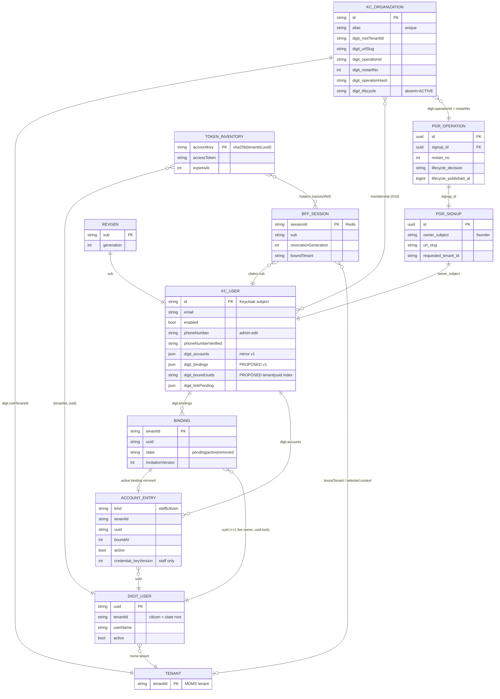

# 03 — Persisted state: current vs target

**Target design:** `IDENTITY-BFF-BOUNDARY-FREEZE.md`, revision 6 (cited as `F §n`).
**Code:** `wt-bff` @ `8d2f2057a`. Paths are relative to the worktree:
- `B/` = `backend/identity-bff/src/modules/`
- `I/` = `backend/identity-bff/src/infrastructure/`
- `K` = `backend/identity-bff/deploy/digit-compose/configure-keycloak.sh`
- `P/` = `backend/pgr-services/src/main/{java/org/egov/pgr/onboarding,resources/db/migration/main}/`
- `U/` = egov-user source at `_worktrees/Digit-Core-keycloak-identity/core-services/egov-user/src/main/java/org/egov/user/`

**Conventions:**
- `{p}` = `CACHE_PREFIX` (default `keycloak`, `I/config.ts:274`).
- **PROPOSED** = a choice made in this document. The design leaves it open, and it should be confirmed at the walkthrough.
- "Lease" means Redis `SET key token NX EX ttl`, released with a compare-and-delete Lua script. Every lease in the code uses this same pattern.

---

## 1. Keycloak user attributes

### 1.1 Current (as built)

All of these are **unmanaged** attributes: none is declared in the user profile. They survive only because `unmanagedAttributePolicy=ADMIN_EDIT` (`K:262-267`).

| Attribute | Shape | Writer (file:line) | Reader (file:line) | Fate in target |
|---|---|---|---|---|
| `digit.managedTenants` | multi-valued; one `tenantId` per value; sorted set | `writeManagedTenant`, `B/organizations/organization-service.ts:99-111`. **Full-user PUT `...user`**, which re-sends `enabled`. Called from `managed-account-service.ts:461,468` | `managedTenantsFromIdentity` `:52-56` → `managedTenantsOf` (`managed-account-service.ts:595-604`); realm-wide walk `listManagedIdentityAccounts` `:59-68` → reconcile (`B/reconciliation/reconciliation-service.ts:131`) | **Delete** (D13, item 14). It only inventories `kcbff-` accounts |
| `digit.citizenRegistrations` | multi-valued; `v1\|<rootTenantId>\|<tenantId>\|<ACTIVE\|DISABLED>\|<digitUuid>` (`B/citizens/citizen-registration.ts:62-85`) | `ensureCitizenRegistration`, `citizen-registration.ts:184-201`, through `updateUserAttributeValues` (`organization-service.ts:227-252`, profile-field-only PUT) | `citizenRegistrations` `citizen-registration.ts:87-92,140` | **Fold into** a citizen entry of `digit.accounts`. D6 removes per-city `DISABLED`, so the per-route value has no remaining purpose (PROPOSED) |
| `digit.accountLinks` | multi-valued; `<EMPLOYEE\|CITIZEN>\|<tenantId>\|<digitUuid>` (`B/account-links/account-links.ts:47-58`) | `createAccountLink` `account-links.ts:147-148`; `removeAccountLink` `:177-180`; via `organization-service.ts:159-164` | `linksOf` / `linkedIdentityFor` `account-links.ts:60-77` (used by `_select` at `B/access-context/routes.ts:138`); one-owner search `q=digit.accountLinks:<v>` `organization-service.ts:174-180` | **Migrate:** EMPLOYEE → `digit.bindings` `active`; CITIZEN → a `digit.accounts` citizen entry |
| `digit.accountLinkBlocks` | same encoding | `account-links.ts:151-154` (an admin link clears the block), `:173-174` (unlink with `block`) | `account-links.ts:139,145` (refuses VERIFIED_PHONE relinks) | **Keep, citizen only.** F §8 retains internal citizen link/unlink and "unlink blocking" (§11) |
| `digit.identityBffInvited` | `["true"]` | user create, `organization-service.ts:1186` | `invitedUser` `:969` (lets an unverified, BFF-created user be re-invited) | **Replace** with `digit.linkPending` (`_invite` is deleted) |
| `digit.identityBffSignup` | `["true"]` | magic-link user create `:945`; removed at `:884`. **Full-user PUT at `:885-893` and `:924-931`, outside the attribute lease** | `:878,913,958` | Keep. Move the PUTs to the safe writer, under the subject lease |
| `digit.identityBffPhoneOtp` | `["true"]` | phone user create `:1068` | **none** (provenance only) | Keep as provenance. It has no reader |
| `phoneNumber` | single E.164 | phone user create `:1066`; Keycloak IdP mappers (none configured in `K`) | `findVerifiedPhoneUsers` `q=phoneNumber:<n> phoneNumberVerified:true` `:1028-1035`; trust check `:207-221`; token claim `phone_number` | Keep. **Declare it in the user profile with admin-only edit** (audit 09 item 3) |
| `phoneNumberVerified` | `"true"` | `:1067` | same | Same |
| *core:* `firstName`, `lastName` | — | invitation/signup create (`:1176-1186`, `:936-947`); `applyVerifiedSignupIdentityProfile` `:885-893` | `readIdentityUserProfile` `:844-859` (feeds the DIGIT account name) | DIGIT→KC mirror (D3/D12); user-read-only |
| *core:* `email`, `emailVerified`, `username`, `requiredActions` | — | create calls only | invitation/signup checks | Never written by the mirror; preserved on every PUT (F §4) |

**Write-path hazards in today's code** (input for the safe Keycloak writer):
- `organization-service.ts:107` (`writeManagedTenant`), `:888` and `:927` PUT the **whole user representation, including `enabled`**. An admin disable that lands between the GET and the PUT is reverted. Only `updateUserAttributeValues` (`:242-250`) sends profile fields only.
- `:885-893` and `:924-931` run **outside** `withUserAttributeLease` (`:76-92`). They can therefore race the attribute writers (Keycloak replaces the whole attribute map).

### 1.2 Target set

| Attribute | Kind | Authority / writer | Readers | Notes |
|---|---|---|---|---|
| `digit.accounts` | single value, JSON `v1` (§1.3) | DIGIT→KC mirror (sync module, item 12). `credential.keyVersion` comes from the credential writer (item 7) | `_select`, D12 profile, revocation fallback, key-retirement scan, DIGIT3 migration (F §7) | Mirror. Never authorizes anything on its own |
| `digit.bindings` | single value, JSON `v1` (§1.4). **PROPOSED** as its own attribute | BFF binding routes (`_link`, `_accept`, `_remove`, `bindings/_ensure`, `memberships/_remove`) | D10 predicate, `_select`, discovery, `pendingInvitations`, reconcile (read only) | The state machine plus tombstones |
| `digit.boundUuids` | multi-valued; `<tenantId>\|<uuid>`. **PROPOSED** | written in the same PUT as `digit.bindings`: one value per `pending`/`active` binding | one-owner check: `q=digit.boundUuids:<v>` | JSON can't be `q`-searched. This index keeps today's `usersWithAccountLink` mechanism (`:174-180`) |
| `digit.linkPending` | single value, JSON (§1.5) | written **inside** the `POST /users` that creates the person (F §5 step 4); cleared at the end of `_link` | `_link` resume check | Resumes only on the same `requestId` |
| `digit.accountLinkBlocks` | as today, CITIZEN values only | internal citizen unlink | citizen legacy resolution | Retained (F §8) |
| `digit.identityBffSignup`, `digit.identityBffPhoneOtp` | `["true"]` | as today | as today | Unchanged |
| `phoneNumber`, `phoneNumberVerified` | as today | BFF phone flows (login create, step-up, change, F §8) | as today | Declared admin-edit in the user profile |
| `firstName`, `lastName`, `locale` | core | mirror from the D12 primary entry | token claims, theme | User-read-only (F §12). See open questions Q11 and Q12 |

**Retired:** `digit.managedTenants`, `digit.citizenRegistrations`, `digit.accountLinks`, `digit.identityBffInvited`.

**Migration (one-time, PROPOSED as part of ops job (a)):**
- each `digit.accountLinks` EMPLOYEE value → `digit.bindings[{state:"active", boundAt: now, createdBy:{kind:"migration"}}]` + `digit.boundUuids`;
- each CITIZEN value and each `digit.citizenRegistrations` uuid → a `digit.accounts` citizen entry.

### 1.3 `digit.accounts` v1 — JSON Schema (PROPOSED concrete shape of F §4 / item 0)

```json
{
  "$schema": "https://json-schema.org/draft/2020-12/schema",
  "$id": "urn:digit:identity:kc-user-attr:digit.accounts:v1",
  "title": "digit.accounts v1 (DIGIT→Keycloak mirror)",
  "type": "object",
  "required": ["v", "entries"],
  "additionalProperties": false,
  "properties": {
    "v": { "const": 1 },
    "mirroredAt": { "type": "integer", "description": "epoch ms of the last successful mirror pass for this subject" },
    "entries": {
      "type": "array",
      "maxItems": 64,
      "items": { "oneOf": [ { "$ref": "#/$defs/staff" }, { "$ref": "#/$defs/citizen" } ] }
    }
  },
  "$defs": {
    "tenantId": { "type": "string", "minLength": 1, "maxLength": 50, "pattern": "^[A-Za-z0-9_-]+(\\.[A-Za-z0-9_-]+)*$" },
    "uuid":     { "type": "string", "format": "uuid" },
    "role": {
      "type": "object", "additionalProperties": false, "required": ["code", "tenantId"],
      "properties": {
        "code":     { "type": "string", "pattern": "^[A-Z0-9_]{1,64}$" },
        "tenantId": { "$ref": "#/$defs/tenantId" }
      }
    },
    "common": {
      "type": "object",
      "required": ["kind", "tenantId", "uuid", "boundAt", "active", "roles"],
      "properties": {
        "tenantId": { "$ref": "#/$defs/tenantId", "description": "the DIGIT account's home tenant (egov-user tenantId)" },
        "uuid":     { "$ref": "#/$defs/uuid" },
        "boundAt":  { "type": "integer", "description": "epoch ms; D12 ordering key; never rewritten after first set" },
        "active":   { "type": "boolean", "description": "DIGIT `active` as last mirrored" },
        "roles":    { "type": "array", "uniqueItems": true, "items": { "$ref": "#/$defs/role" } },
        "userName": { "type": "string", "maxLength": 64, "description": "PROPOSED: DIGIT username (immutable in egov-user; UserRepository keeps oldUser username). Lets the revocation fallback grant without a search" },
        "name":     { "type": "string", "maxLength": 50, "description": "DIGIT name as mirrored (D12 source)" },
        "locale":   { "type": ["string", "null"], "maxLength": 16 }
      }
    },
    "staff": {
      "allOf": [ { "$ref": "#/$defs/common" } ],
      "properties": {
        "kind": { "const": "staff" },
        "credential": {
          "type": "object", "additionalProperties": false, "required": ["keyVersion"],
          "properties": {
            "keyVersion": { "type": "integer", "minimum": 1 },
            "setAt":      { "type": "integer", "description": "epoch ms the derived password was last written to egov-user" }
          },
          "description": "absent = links made before item 7; the credential is set at first issuance (F §6)"
        }
      },
      "unevaluatedProperties": false
    },
    "citizen": {
      "allOf": [ { "$ref": "#/$defs/common" } ],
      "properties": {
        "kind":   { "const": "citizen" },
        "origin": { "enum": ["managed", "linked", "legacy-phone"], "description": "PROPOSED: kcbffc- managed / admin-linked / resolved by verified phone (F §8). Needed until D13 cleanup" }
      },
      "not": { "required": ["credential"] },
      "unevaluatedProperties": false
    }
  }
}
```

**Invariants (PROPOSED; enforced in code, not expressible in the schema):**
- `(tenantId, uuid)` is unique within `entries`.
- At most **one** `staff` entry per `tenantId`, matching the binding key `(subject, tenant)`.
- There is a `staff` entry **only** for a binding in state `active`. Pending and removed bindings have no mirror entry; reconcile drops the entry when the binding leaves `active`.
- At most one `citizen` entry per `digitCitizenTenantId` (the state root, `managed-account-service.ts:196-198`).
- The D12 primary entry is the lowest `boundAt`. If that entry is inactive, the next one with `active:true` is used.
- **Size:** each entry is about 200 B plus about 45 B per role. Keycloak 26 stores long attribute values (the `LONG_VALUE` column), so one document is acceptable. Gate test: a user with 20 entries survives a PUT and a GET.

### 1.4 Binding state — `digit.bindings` v1 (PROPOSED)

**Where binding state lives (decision, PROPOSED):**
- The **durable** state is the `digit.bindings` attribute on the person's own Keycloak user (D9).
- **Redis** holds only the uuid lock (§3.2) and nothing else durable.
- It is **separate from `digit.accounts`** for three reasons:
  1. Authority is split: binding state belongs to the BFF, while `digit.accounts` is a mirror of DIGIT. The mirror writer is type-restricted, so it **cannot** create or restore a binding (F §4 rule: reconcile never does that).
  2. Echo suppression ("admin events that touch only mirrored fields") becomes a check on which attributes changed.
  3. A pending binding has no DIGIT data to mirror.
- *Alternative A:* put `binding:{state, invitationVersion, …}` inside each `digit.accounts` entry. That is one attribute and one read-modify-write, but it mixes the two authorities.

```json
{
  "$schema": "https://json-schema.org/draft/2020-12/schema",
  "$id": "urn:digit:identity:kc-user-attr:digit.bindings:v1",
  "type": "object", "required": ["v", "bindings"], "additionalProperties": false,
  "properties": {
    "v": { "const": 1 },
    "bindings": {
      "type": "array", "maxItems": 64,
      "items": {
        "type": "object", "additionalProperties": false,
        "required": ["tenantId", "uuid", "state", "invitationVersion", "createdAt", "createdBy"],
        "properties": {
          "tenantId": { "type": "string", "maxLength": 50, "description": "DIGIT account tenant: the binding key with the subject" },
          "uuid":     { "type": "string", "format": "uuid" },
          "state":    { "enum": ["pending", "active", "removed"] },
          "invitationVersion": { "type": "integer", "minimum": 1, "description": "bumped only by an explicit re-invite (removed → pending). Stale versions → 409 INVITATION_STALE" },
          "createdAt":  { "type": "integer" },
          "createdBy":  {
            "type": "object", "additionalProperties": false, "required": ["kind"],
            "properties": {
              "kind":        { "enum": ["browser", "workload", "migration"] },
              "subject":     { "type": "string", "description": "browser actor (live DIGIT ACCOUNT_ADMIN at tenantId)" },
              "operationId": { "type": "string", "format": "uuid", "description": "workload: PGR operation" },
              "restartNo":   { "type": "integer", "minimum": 0 },
              "requestId":   { "type": "string", "maxLength": 128, "description": "the _link request that created it" }
            }
          },
          "acceptedAt": { "type": "integer" },
          "removedAt":  { "type": "integer" },
          "removedBy":  { "type": "object", "properties": { "kind": { "enum": ["browser", "workload", "admin"] }, "subject": { "type": "string" }, "operationId": { "type": "string" } } }
        },
        "allOf": [
          { "if": { "properties": { "state": { "const": "removed" } } }, "then": { "required": ["removedAt"] } },
          { "if": { "properties": { "state": { "const": "active" }, "createdBy": { "properties": { "kind": { "const": "browser" } } } } },
            "then": { "description": "an existing user only reaches active via _accept (acceptedAt); a new user via _link's new-user branch" } }
        ]
      }
    }
  }
}
```

**Transitions (key = `(subject, tenantId)`; at most one record per key; the record itself is the tombstone):**

| From → To | Trigger | Guard (all checked under the subject lease + the uuid lock) |
|---|---|---|
| ∅ → `active` | `_link`, new-user branch; `bindings/_ensure` (workload); migration | uuid unowned (`q=digit.boundUuids`); browser actor rules (no self-bind, no role escalation); workload: same key + different uuid → 409 `BINDING_CONFLICT` |
| ∅ → `pending` (v=1) | `_link`, existing-user branch | same |
| `pending` → `active` | `_accept {tenantId, invitationVersion}` by the bound subject | version equal, else 409 `INVITATION_STALE`; grants Organization membership |
| `pending`/`active` → `removed` | `_remove`; `memberships/_remove` | releases the `digit.boundUuids` value; removes membership; revokes tokens |
| `removed` → `pending` (v+1) | **explicit** re-invite only | a repeat of the original `_link` request is a no-op and never resurrects |
| `active` → `pending` | **never** | "never demotes an active binding" |

### 1.5 `digit.linkPending` — JSON Schema (PROPOSED)

```json
{
  "$schema": "https://json-schema.org/draft/2020-12/schema",
  "$id": "urn:digit:identity:kc-user-attr:digit.linkPending:v1",
  "type": "object", "additionalProperties": false,
  "required": ["v", "tenantId", "digitUuid", "email", "requestId", "actor", "createdAt"],
  "properties": {
    "v":         { "const": 1 },
    "tenantId":  { "type": "string", "maxLength": 50 },
    "digitUuid": { "type": "string", "format": "uuid" },
    "email":     { "type": "string", "format": "email", "description": "normalized lower-case" },
    "requestId": { "type": "string", "pattern": "^[0-9a-f]{64}$", "description": "PROPOSED: sha256(actorSubject \\n tenantId \\n digitUuid \\n email). Deterministic, so a client retry needs no Idempotency-Key" },
    "actor":     { "type": "string", "description": "Keycloak subject of the ACCOUNT_ADMIN who called _link" },
    "createdAt": { "type": "integer" },
    "steps":     { "type": "array", "items": { "enum": ["membership", "binding", "email"] }, "description": "optional progress hint; resume re-checks live state regardless" }
  }
}
```

**Resume rule (F §5):**
- If `_link` finds the user by email **with** `linkPending.requestId == this requestId`, it takes the new-user branch.
- Any other `_link` (another workspace, or another uuid) takes the existing-user branch.
- The marker is deleted in the final PUT.

---

## 2. Keycloak Organization, group, client and realm state

### 2.1 Organization attributes

| Attribute | Current writer → reader | Target |
|---|---|---|
| `digit.rootTenantId` (exactly 1 value) | `ensureOrganization` `organization-service.ts:777-781` (create), `:813-829` (PUT `...organization`) → `mappedTenant` `:396-399`, `organizationsForTenant` `q=` `:441-457` | Keep. Written by `organizations/_ensure` |
| `digit.urlSlug` | `:780`, `:826` → `asMapping` `:477` (falls back to `alias`); identifier check `:421` | Keep, **lower-cased**. Uniqueness: Redis slug lock + live scan |
| `digit.accountCode` | `:779`, `:825` (onboarding worker `B/onboarding/worker.ts:168`) → identifier check `:423` | **Open (Q9):** the F §5 `_ensure` payload drops it, but PGR still reserves `ACCOUNT_CODE` |
| `digit.fallbackTenantIds` | read only (`:482`); never written on an Organization | Keep as read-only legacy |
| `digit.tenantId` | not on Organizations today (only on groups) | **PROPOSED:** add it only if `_ensure.tenantId ≠ rootTenantId` is a real case (Q8). Otherwise drop the field from the contract |
| `digit.operationId` | — | **New.** The PGR operation uuid. Re-open matches on this, not on slug |
| `digit.restartNo` | — | **New.** Integer as a string; lower → `ATTEMPT_STALE` |
| `digit.operationHash` | — | **New.** `sha256(canonicalJSON({name: trim(name), rootTenantId, slug: lower(slug), tenantId}))`. Canonical form PROPOSED: RFC 8785 (JCS), keys sorted, no whitespace |
| `digit.lifecycle` | — | **New.** `PROVISIONING` \| `ACTIVE` \| `FAILED`; **absent = ACTIVE** |
| `digit.lifecycleRestartNo` | — | **New (PROPOSED).** The restartNo at which `digit.lifecycle` was last set, so a repeated `_lifecycle` call is recognized as the same transition |
| `digit.supersededBy` | — | **New (PROPOSED).** Set on the old Organization when a slug change creates a new one |

**Constraints the re-open path must handle** (to verify on Keycloak 26.7.3):
1. Keycloak Organization **`name` and `alias` are realm-unique**. A slug change creates a new Organization (F §5), so the old `FAILED` one must be **renamed** before the create. Otherwise the create returns 409 on `name`.
2. `withoutCollisions` (`:665-688`) drops **both** mappings when two Organizations share a tenantId. `organizationsForTenant` + `ensureOrganization` return 409 on `matches.length > 1` (`:760-762`). The visibility filter (`lifecycle ∈ {absent, ACTIVE}`) therefore has to run **before** collision detection, and `_ensure` must ignore `FAILED` Organizations of the same operationId.
3. `ensureOrganization` refuses to re-enable a disabled Organization (`:806-808`). Lifecycle is a separate attribute and never touches `enabled`.

### 2.2 Organization-group attributes (subtenant mappings; current)

Seven attributes are written by `ensureOrganizationTenantGroup` (`:1332-1340`) and read by `asGroupMapping` (`:543-569`):

| Attribute | Value |
|---|---|
| `digit.organizationId` | — |
| `digit.tenantId` | — |
| `digit.rootTenantId` | — |
| `digit.parentTenantId` | — |
| `digit.urlSlug` | — |
| `digit.displayName` | — |
| `digit.fallbackTenantIds` | multi-valued |

There are also **role-assignment groups**:
- `<group>--<userId>` (`:1385-1431`);
- `tenant-admins` and `employees` (`I/config.ts:232-242`).

**Target:**
- `tenant-groups/_ensure` and the role projection are deleted (D1, D15). The role-assignment groups become inert.
- **Open (Q10):** does the read path for existing subtenant group mappings (`listTenantMappings` `:641-657`) stay for routing, or do those mappings get migrated?

### 2.3 Client attributes

| Attribute | Clients | Writer → reader | Target |
|---|---|---|---|
| `digit.auth.surface` | `digit-ui-employee`, `digit-ui-citizen` | `K:242` → `B/authentication/methods.ts:15,77-80` | Keep; becomes the surface-registry key (item 1) |
| `digit.auth.signin.methods` | BFF client (`K:404`), digit-ui clients (`K:243`) | → `methods.ts:83` | Keep. Add the `hosted` method declaration (item 2). Encoding open: e.g. `hosted:<execution-alias>` in the same CSV (PROPOSED) |
| `digit.auth.signup.methods` | as above; `""` = absent (`K:217-226`) | → `methods.ts:86-90` | Keep |
| `digit.auth.account.actions` | — | — | **New** (F §8). CSV allowlist ⊆ `UPDATE_PASSWORD,CONFIGURE_TOTP,delete_credential,UPDATE_EMAIL,idp_link`. Absent = none |
| `login_theme`, `pkce.code.challenge.method=S256`, `post.logout.redirect.uris=+`, `standard.token.exchange.enabled=false` | all | `K:237-245,338-341,401-406` | Unchanged |

### 2.4 Realm settings the design depends on

| Setting | Today (`K`) | Target (F §6, §8, §12) |
|---|---|---|
| `organizationsEnabled` | `true` (`K:365`) | Same |
| `loginWithEmailAllowed=true`, `duplicateEmailsAllowed=false`, `resetPasswordAllowed=false` | pinned `K:365-367` | Same. Email uniqueness backs `_link` find-by-email (`:989-998`) |
| `registrationAllowed=false`, `bruteForceProtected=true`, `accessTokenLifespan=300`, `ssoSessionIdleTimeout=1800`, `ssoSessionMaxLifespan=604800` | **new realms only** (`K:356-360`) | Pin on existing realms too (PROPOSED). The session TTL (`IDENTITY_SESSION_TTL_SECONDS=604800`) assumes these values |
| User profile `unmanagedAttributePolicy` | `ADMIN_EDIT` (`K:262-267`) | Same. **Also declare** every `digit.*` attribute plus `phoneNumber`/`phoneNumberVerified` with view/edit `admin` only (audit 09 #3) |
| `firstName`/`lastName` (and `locale`) edit permission | default (user-editable) | `edit: [admin]`. **Gotcha:** if `lastName` stays `required` for role `user`, an empty mirrored lastName forces `VERIFY_PROFILE` on a field the user can't edit. Set `required` to none, or mirror `"-"` (Q11) |
| Event store (`eventsEnabled`, `enabledEventTypes`, `eventsExpiration`) | **not configured** | `eventsEnabled=true`. Types must include at least: `LOGIN`, `LOGOUT`, `UPDATE_PASSWORD`, `UPDATE_CREDENTIAL`, `REMOVE_CREDENTIAL`, `UPDATE_EMAIL`, `FEDERATED_IDENTITY_LINK`, `REMOVE_FEDERATED_IDENTITY`, `DELETE_ACCOUNT`. Expiration longer than the longest tolerated BFF outage |
| Admin events (`adminEventsEnabled`, `adminEventsDetailsEnabled`, admin-event expiration) | **not configured** | All on. **`adminEventsDetailsEnabled=true` is required**: echo suppression compares the representation's touched fields, and membership-removal and logout-all are only visible as admin events |
| Service-account roles of `digit-identity-admin` | `manage/query/view-users`, `manage/query/view-organizations`, `query/view-clients`, `view-identity-providers` (`K:476-483`) | **Add `view-events`.** The poller can't read events without it |
| Employee browser flow | `auth-username-password-form` REQUIRED only; cookie removed (`K:208-213`) | Add a conditional sub-flow: `conditional-user-configured` → `auth-otp-form` (F §12) |
| Required actions | defaults | `UPDATE_PASSWORD`, `CONFIGURE_TOTP`, `delete_credential`, `UPDATE_EMAIL`, `idp_link` enabled. Each is a gate item on 26.7.3 |
| Internationalization | not set | Needed only if `locale` is mirrored (Q12) |

---

## 3. Redis keyspace

### 3.1 Current families (23)

| # | Pattern | Type / value | TTL | Write semantics | Writer → reader (file:line) |
|---|---|---|---|---|---|
| 1 | `{p}:identity:login:{state}` | STRING JSON `LoginAttempt` `{codeVerifier, nonce, oidcClientId, intent, methodId, returnTo, requiresLoginCookie, identityProfileDraft?, surface?, boundTenant?}` | `IDENTITY_LOGIN_TTL_SECONDS` = 1800 | `SET EX` | `B/sessions/session-store.ts:91-101` → `GETDEL` `:155-159` |
| 2 | `{p}:identity:session:{sessionId}` | STRING JSON `IdentitySession` (§4) | `min(IDENTITY_SESSION_TTL_SECONDS 604800, refresh‖access TTL)` `:222-225` | **`SET EX` always overwrites** (`:271-276`); touch = `SET KEEPTTL` (`:313`) | `saveIdentitySession`: create `:227-239`, refresh `B/sessions/current-session.ts:80-88`, phone OTP `:284-309`; touch `current-session.ts:50`; delete `:335-337` |
| 3 | `{p}:identity:auth-result:{id}` | STRING JSON `IdentityAuthResult` | 300 | `SET EX` / `GETDEL` | `session-store.ts:161-180` |
| 4 | `{p}:identity:password-setup:{id}` | STRING JSON `{returnTo, userId, hadPassword}` | 900 + 1800 | `SET EX` | `:182-220` |
| 5 | `{p}:identity:context:{sessionId}` | STRING JSON `{organizationId, organizationAlias, tenantId, name}` | the session key's remaining TTL | `SET EX ttl(session)`, refused if the session TTL ≤ 0 | `:351-364` ← `B/access-context/routes.ts:144,172`; deleted with the session `:336` |
| 6 | `{p}:identity:user-attributes-lease:{userId}` | lease | 30 s; wait 5 s | NX lease | `organization-service.ts:76-92` |
| 7 | `{p}:account-link-lease:{digitUuid}` | lease | `DIGIT_USER_LEASE_SECONDS` 30; wait 15 s | NX lease | `account-links.ts:80-97` |
| 8 | `{p}:identity-reconciliation-lease` | lease (single global) | 300 | NX lease | `reconciliation-service.ts:32,103-105` |
| 9 | `{p}:digit-user-token:{identityKey}` | STRING JSON `DigitLogin {accessToken, expiresAt, user}` | **`expiresAt − 60 s skew`** (`:367`) | `SET EX`; `GETDEL` on drop | `managed-account-service.ts:362-386` |
| 10 | `{p}:digit-user-token-holders:{identityKey}` | SET of `sessionTokenRef` (`sha256(sid)[:32]`) | 604800, refreshed on each hold | `SADD` + `EXPIRE`; reset on new token | `:357-360,372,394-397` |
| 11 | `{p}:digit-citizen-mobile:{identityKey}` | STRING national mobile number | **none (permanent)** | `SET` | `:454,540` → `:534` (the "phone memo"; item 15 drift) |
| 12 | `{p}:digit-user-lease:{identityKey}` | lease | 30; wait 15 s | NX lease | `:274-293` |
| 13 | `{p}:digit-managed-accounts` | HASH `"{subject}\|{tenantId}" → issuer` | **none** | `HSET` | `:460,467` → `:595-604`, reconcile `:126` |
| 14 | `{p}:digit-linked-identities:{sha256(iss\nsub)}` | SET JSON `{userType, tenantId, digitUuid}` | 604800 | `SADD` + `EXPIRE` | `:114-123` → logout `:126-144` |
| 15 | `{p}:identity:citizen-otp:challenge:{id}` | HASH `{hash, attempts, phoneNumber, tenant(JSON), claimed?}` | `IDENTITY_CITIZEN_OTP_TTL_SECONDS` 300 | `MULTI HSET+EXPIRE`; Lua claim (`CLAIM_CODE`) | `B/citizen-otp/otp-store.ts:90-169` |
| 16 | `{p}:identity:citizen-otp:cooldown:{phoneRef}` | STRING `"1"` | 30 | `SET NX EX` | `:69-73`, refund `:86` |
| 17 | `{p}:identity:citizen-otp:sends:phone:{phoneRef}` | counter | window 3600 (limit 5) | Lua INCR + EXPIRE-if-none | `I/rate-limit.ts:8-15`; `otp-store.ts:76` |
| 18 | `{p}:identity:citizen-otp:sends:ip:{ipRef}` | counter | 3600 (limit 20) | same | `otp-store.ts:64` |
| 19 | `{p}:identity:audit` | STREAM, fields = `CitizenOtpAuditRecord` | none; `MAXLEN ~ 100000` | `XADD` | `B/citizen-otp/audit.ts:31-52` |
| 20 | `{p}:identity:magic-link-signup-limit:ip:{rawIp}` | counter | 1800 (limit 3) | Lua | `B/authentication/magic-link-signup.ts:137-141`. **The raw IP is in the key** |
| 21 | `{p}:identity:magic-link-signup-limit:email:{hmac}` | counter | 1800 (limit 3) | Lua | same; HMAC keyed off the BFF client secret `:36-41` |
| 22 | `{p}:identity:password-setup-limit:ip:{rawIp}` | counter | 900 (limit 3) | Lua | `B/authentication/password-setup.ts:116-121` |
| 23 | `{p}:identity:password-setup-limit:account:{hmac}` | counter | 900 (limit 3) | Lua | same; `:46-53` |

**Identity keys:**
- `identityKey` = `sha256(iss\nsub\ntenant)` for managed employees (`:171-183`);
- `sha256("citizen"\niss\nsub\ncitizenTenant)` for managed citizens (`:207-222`);
- `sha256("link"\niss\nsub\ntype\ntenant\nuuid)` for linked accounts (`:85-97`).

**In-process caches (not Redis; per replica; lost on restart):**

| Cache | Lifetime |
|---|---|
| tenant mappings | 60 s (`organization-service.ts:525-532`) |
| tenant-directory mappings | 60 s |
| active tenants | 300 s (`B/access-context/tenant-directory.ts:27-28`) |
| branding / masters | 300 s (`B/branding/tenant-branding.ts:86-87`) |
| method catalogue | 10 s (`methods.ts:16,25`) |
| phone-trust | 60 s (`:199`) |
| JWKS | — |
| Keycloak admin token | — |
| DIGIT admin and provisioner tokens | `digit-admin-session.ts:21` |

### 3.2 Target: retained, changed, retired, new

**Changed or retired:**

| Family | Change |
|---|---|
| #2 session | **Update-only:** save/touch use `SET … XX` (refresh: `SET XX EX`; touch: `SET XX KEEPTTL`). Only `createIdentitySession` uses `SET NX EX`. A session that revocation deleted is never recreated (F §6). Schema additions in §4 |
| #5 context | Keep. Also `SET XX`-guarded: delete the context if the session is gone |
| #9 token cache → **token inventory** | Rename to `{p}:identity:token:{accountKey}`, where `accountKey = sha256("acct\n" tenantId "\n" uuid)` (PROPOSED: keyed by **DIGIT account**, because egov-user returns one live token per account, `managed-account-service.ts:242-249`). **TTL = actual `expiresAt`**; the 60 s skew is applied only at read time (as `cachedLogin` already does at `:350`). Value `{accessToken, expiresAt, mintedAt, subject, kind, keyVersion?}` |
| #10 holders | Keep (rename `{p}:identity:token-holders:{accountKey}`); TTL = token `expiresAt` |
| #6, #12 leases | **Merge into the per-subject lease** (new #N1, PROPOSED), so there is one non-reentrant lease per subject and no lock-order deadlock |
| #7 | Rename `{p}:identity:uuid-lock:{tenantId}:{uuid}`. It is the uuid binding lock |
| #8 | Keep; renewed during cursor batches |
| #11 citizen phone memo | **Retire** (item 15 drift). Compare against an unmasked admin search, or key it by `accountKey` with TTL = the session TTL (PROPOSED: retire) |
| #13, #14, `digit.managedTenants` | **Retire** (item 14). Replaced by #N4 plus `digit.bindings`/`digit.accounts` |
| #15 OTP challenge | Add fields `purpose` (`signin`\|`stepup`\|`change`), `subject`, `sessionRef`, `newPhone` (F §8 challenge binding). `CLAIM_CODE` compares them |
| #20, #22 | Hash the IP with `privateRef("ip", …)` (consistent with #18). PROPOSED, minor |

**New families (16):**

| # | Pattern | Type / value | TTL | Write semantics | Writer → reader |
|---|---|---|---|---|---|
| N1 | `{p}:identity:subject-lease:{sub}` | lease token | 30 s, **renewed** while held; wait ≤ 15 s | `SET NX EX`; renew with Lua `if get==tok then pexpire`; **fencing**: inventory writes use Lua `if get(lease)==tok then SET token…` | `_select`, revocation, Keycloak writer, provider `_unlink`, binding transitions |
| N2 | `{p}:identity:revgen:{sub}` | integer | none (PROPOSED). If a TTL is used, it must be ≥ the session TTL, refreshed on `INCR` | `INCR` (logout-all, credential change, disable) | `_select` step 1 + `currentSession` compare with `session.revocationGeneration` |
| N3 | `{p}:identity:token:{accountKey}` | see the #9 change | to actual expiry | `SET EX`, only under the N1 fence | `_select`, revocation |
| N4 | `{p}:identity:subject-tokens:{sub}` | SET of `accountKey` | max token expiry | `SADD` + `EXPIREAT max` | revocation enumerates tokens per subject, including citizens |
| N5 | `{p}:identity:revoke-retry` | ZSET member=`retryId`, score=`nextAttemptAt` | — | `ZADD`; removed on success, or when the item hash expired | retry worker |
| N6 | `{p}:identity:revoke-retry:{retryId}` | HASH `{accountKey, accessToken, expiresAt, subject, reason, attempts}` | `EXPIREAT expiresAt` | `HSET` | retry worker. Kept "until success or expiry" (F §6) |
| N7 | `{p}:identity:revoke-subject-jobs` | ZSET member=`sub\|reason\|eventId`, score=`due` | — | `ZADD` **before** the poller checkpoint advances | subject-level revocation (event effects, retention-gap sweep) |
| N8 | `{p}:identity:kc-events:{user\|admin}:checkpoint` | HASH `{time, idsAtTime(JSON)}` | none | `HSET`, only after the effect or N7 job is recorded | event poller; `/readyz` lag |
| N9 | `{p}:identity:kc-events:{user\|admin}:seen` | ZSET `eventId → time` | trimmed to the overlap window (`ZREMRANGEBYSCORE`) | `ZADD NX` (dedupe `(time,id)`) | poller |
| N10 | `{p}:identity:kc-events:lease` | lease | e.g. 60 s, renewed | NX | single active poller across replicas |
| N11 | `{p}:identity:phone-lock:{phoneRef}` | lease (`phoneRef = privateRef("phone", e164)`) | 30 s | NX | phone login, step-up, change (F §8) |
| N12 | `{p}:identity:op-lock:{operationId}` | lease | 60 s, renewed | NX; validation + mutation inside | all F §5 workload primitives |
| N13 | `{p}:identity:slug-lock:{lowerSlug}` / `{p}:identity:tenant-lock:{tenantId}` | lease | 60 s | NX. **Lock order: op → tenant → slug** (PROPOSED) | `organizations/_ensure` |
| N14 | `{p}:identity:pwchange:{sub}` | HASH `{sessionId, startedAt, oidcClientId}` | short: `IDENTITY_LOGIN_TTL_SECONDS` (1800) PROPOSED | `HSET` + `EXPIRE` at `/authorize?action=UPDATE_PASSWORD`; `DEL` on match | event effect: revoke the others, bump N2, rewrite the initiator session's generation (`SET XX KEEPTTL`) |
| N15 | `{p}:identity:uuid-lock:{tenantId}:{uuid}` | lease | 30 s | NX | binding create/accept/remove (rename of #7) |
| N16 | `{p}:identity:reconcile:{cursor\|stats}` | HASH `{first, startedAt}` / `{lastCompleteAt, lagMs, failures}` | none | `HSET` per batch | reconcile; `/readyz` and the lag metric |

**Optional (PROPOSED):** `{p}:identity:mirror-fp:{sub}` (a hash of the last mirrored `digit.accounts`). It lets reconcile skip unchanged subjects without a Keycloak GET.

**Lease topology (PROPOSED):**
- The **subject lease (N1)** is the only lease around any Keycloak user read-modify-write, `_select`, revocation or unlink for that person.
- Short locks are taken **inside** it, in this order: phone (N11) → uuid (N15).
- Workload primitives take op (N12) → tenant/slug (N13) → subject (N1) → uuid (N15).
- This fixed order prevents the deadlock that the reentrancy gap would cause today: the attribute lease is non-reentrant, while `_select` would hold N1 and then write `credential.keyVersion`.

---

## 4. Session record

### 4.1 Current `IdentitySession` (`B/sessions/types.ts:11-33`)

| Field | Type | Notes |
|---|---|---|
| `claims` | `KeycloakClaims` | `{sub, email, name?, preferred_username?, email_verified?, phone_number?, phone_number_verified?, realm_access?, groups?, organization?, nonce?, azp?, realm?}` (`B/authentication/types.ts:1-17`) |
| `oidcClientId?` | string | absent on old sessions |
| `accessToken` | string | `""` for `phone_otp` |
| `refreshToken?` | string | — |
| `accessExpiresAt` | epoch ms | — |
| `refreshExpiresAt?` | epoch ms | — |
| `sessionExpiresAt` | epoch ms | absolute lifetime |
| `surface?` | `configurator`\|`employee`\|`citizen` | absent = configurator |
| `boundTenant?` | `{urlSlug, tenantId, rootTenantId, name}` | required for employee/citizen (`validBinding` `:115-121`) |
| `authMethod?` | `"phone_otp"` | — |
| `identityCheckedAt?` | epoch ms | phone_otp Keycloak-enabled re-check every 60 s (`current-session.ts:16,37-51`) |

### 4.2 Target additions (F §6, §8)

| Field | Type | Set / checked | Purpose |
|---|---|---|---|
| `revocationGeneration` | integer | set at create from `GET revgen:{sub}` (absent = 0). Compared in `_select` step 1 **and** in `currentSession` | logout-all / credential change end every session lazily, with no session index |
| `kcSessionId` | string (`sid` claim) | at create/refresh | match a Keycloak `LOGOUT` user event to exactly this BFF session (PROPOSED) |
| `phoneRef` | string | citizen sessions | invalidate "sessions carrying the old number" on phone change without storing the raw number twice (PROPOSED; `claims.phone_number` stays) |
| `schemaVersion` | `2` | — | reject or upgrade old records explicitly (PROPOSED) |

**Write rules:**
- `create`: `SET NX EX`.
- `refresh`: `SET XX EX` (it keeps `revocationGeneration` from the record it **re-read**, never from a stale copy).
- `touch`: `SET XX KEEPTTL`.
- A `nil` reply means the session was revoked: return 401 and never recreate.

**LoginAttempt additions (PROPOSED):**
- `action?` (`kc_action` value);
- `actionParam?` (credential id or IdP alias);
- `initiatingSessionId?` (the N14 source, used when the action is `UPDATE_PASSWORD`).

**SelectedIdentityContext addition (PROPOSED):** `digitUuid` + `accountKey`, so logout releases exactly the token that was selected.

---

## 5. PGR onboarding tables

### 5.1 Current (`P/V20260914000000…`, `…120000…`, `V20260918000000…`)

| Table | Columns | Constraints |
|---|---|---|
| `eg_pgr_onboarding_signup` | `id uuid PK`, `owner_issuer`, `owner_subject`, `status` (DRAFT/PROVISIONING/ACTIVE/FAILED), `account_name`, `account_code`, `organization_alias`, `requested_tenant_id`, `url_slug`, `country_code`, `languages jsonb`, `time_zone`, `financial_year_policy`, `accepted_terms_version`, `tenant_metadata jsonb`, `idempotency_key`, `version`, `created_at`, `updated_at` | `UNIQUE(owner_issuer, owner_subject)`; partial unique `(owner_issuer, owner_subject, idempotency_key)` |
| `eg_pgr_onboarding_identifier` | `identifier_type`, `normalized_value` (PK pair), `signup_id` FK, `status` (RESERVED/CONSUMED/RELEASED), `reserved_at` | — |
| `eg_pgr_onboarding_operation` | `id uuid PK`, `signup_id` FK UNIQUE, `status` (PENDING/RUNNING/SUCCEEDED/RETRYABLE_FAILED/TERMINAL_FAILED), `current_step`, `completed_steps jsonb`, `error_code`, `error_message`, `attempt`, `idempotency_key`, `created_at`, `updated_at`, `lease_owner`, `lease_token uuid`, `lease_expires_at` | `UNIQUE(signup_id, idempotency_key)`; index `(status, updated_at)` |

`attempt` goes up on **both** `resubmit` (`P/OnboardingRepository.java:141-143`, from TERMINAL_FAILED) and `retry` (`:170-172`, from RETRYABLE_FAILED). That is why F §5 needs `restart_no`.

### 5.2 Target DDL (PROPOSED)

```sql
-- V2026100X000000__onboarding_restart_no_and_lifecycle_publication.sql
ALTER TABLE eg_pgr_onboarding_operation
    ADD COLUMN IF NOT EXISTS restart_no                 integer NOT NULL DEFAULT 0,
    ADD COLUMN IF NOT EXISTS organization_id            character varying(64),
    ADD COLUMN IF NOT EXISTS founder_subject            character varying(128),
    ADD COLUMN IF NOT EXISTS founder_digit_uuid         character varying(64),
    ADD COLUMN IF NOT EXISTS lifecycle_decision         character varying(16),
    ADD COLUMN IF NOT EXISTS lifecycle_restart_no       integer,
    ADD COLUMN IF NOT EXISTS lifecycle_decided_at       bigint,
    ADD COLUMN IF NOT EXISTS lifecycle_published_at     bigint,
    ADD COLUMN IF NOT EXISTS lifecycle_publish_attempts integer NOT NULL DEFAULT 0,
    ADD COLUMN IF NOT EXISTS lifecycle_last_error       character varying(128);

ALTER TABLE eg_pgr_onboarding_operation
    ADD CONSTRAINT ck_pgr_onboarding_lifecycle_decision
        CHECK (lifecycle_decision IS NULL OR lifecycle_decision IN ('ACTIVE', 'FAILED')),
    ADD CONSTRAINT ck_pgr_onboarding_lifecycle_published
        CHECK (lifecycle_published_at IS NULL OR lifecycle_decision IS NOT NULL),
    ADD CONSTRAINT ck_pgr_onboarding_lifecycle_restart
        CHECK (lifecycle_restart_no IS NULL OR lifecycle_restart_no = restart_no);

-- Publisher scan: decided but not yet acknowledged by the BFF.
CREATE INDEX IF NOT EXISTS idx_pgr_onboarding_lifecycle_unpublished
    ON eg_pgr_onboarding_operation (lifecycle_decided_at)
    WHERE lifecycle_decision IS NOT NULL AND lifecycle_published_at IS NULL;
```

**Semantics:**
- **`resubmit`** (only there) sets `restart_no = restart_no + 1`. It also clears `lifecycle_*`, and adds the guard `AND (lifecycle_decision IS NULL OR lifecycle_published_at IS NOT NULL)`, so that "a terminal restart waits until the previous publication is settled".
- **`retry`** does not touch `restart_no`.
- The terminal decision is written in the same transaction as `finishOperation` (`:211-219`): `lifecycle_decision`, `lifecycle_restart_no = restart_no`, `lifecycle_decided_at`.
- The publisher replays `_lifecycle {operationId, restartNo, state}` until a 2xx, then sets `lifecycle_published_at`.
- `founder_subject` / `founder_digit_uuid` let PGR call `memberships/_remove` for a previous founder, and detect `BINDING_CONFLICT` itself.
- **Open (Q13):** `completed_steps` survives a resubmit today. Should the BFF steps (`organizations/_ensure` and later) be cleared on restart so they re-stamp?

**Readiness / workspace row (#2103):** not in this worktree. F §5 says readiness is served from it; its schema is out of scope here.

---

## 6. egov-user fields: the safe DIGIT writer field map

Sources:
- search response `U/web/contract/UserSearchResponseContent.java:24-70`;
- request `U/web/contract/UserRequest.java:29-153`;
- update semantics `U/persistence/repository/UserRepository.java:200-345`.

The BFF DTO today has 12 fields (`B/managed-accounts/digit-user-client.ts:27-47`). The linked writer spreads the **raw** search object back (`managed-account-service.ts:153-164`). The managed writer sends only `editable()` (`:328-343`).

| Field | Search → request format | `_updatenovalidate` when null / absent | Safe-writer rule (PROPOSED) |
|---|---|---|---|
| `id`, `uuid`, `tenantId` | same | identity | copy |
| `userName` | same | **old value kept** (`:205`) | copy (immutable) |
| `type` | same | old kept | omit |
| `name` | same; `@Pattern NAME`, ≤50 | **written as sent** | copy; masked → skip write |
| `gender` | same (enum string) | **null → 0** | copy |
| `mobileNumber`, `countryCode` | same | old kept | identifier write: set the verified value. Otherwise **omit** (so a masked value is harmless) |
| `emailId` | same; `@Email` ≤128 | **written as sent** | staff identifier: Keycloak verified email; else copy; masked → skip write |
| `altContactNumber`, `alternatemobilenumber`, `pan`, `aadhaarNumber`, `salutation`, `signature`, `identificationMark`, `locale`, `fatherOrHusbandName`(→`Guardian`) | same | **written as sent** | copy; any masked → skip write |
| `relationship` (GuardianRelation) | same | null → `""` | copy |
| `dob` | **`yyyy-MM-dd` → `dd/MM/yyyy`** | old kept | convert, or omit (omit is safe: null keeps). PROPOSED: **omit** |
| `photo` | same | `http…` → old kept, else as sent | copy (fileStoreId) |
| `bloodGroup` | same | old kept | omit |
| `active` | same | old kept | **always omit** (D4: the BFF never writes `active`) |
| `accountLocked`, `accountLockedDate` | same | old kept | omit |
| `roles` | same | empty/null or equal → unchanged (`:336-339`) | **always omit** (D1) |
| `password` | n/a | empty → old kept | set only for the derived credential |
| `pwdExpiryDate` | `dd-MM-yyyy HH:mm:ss` both | old kept | omit |
| `createdDate`, `lastModifiedDate` | `dd-MM-yyyy HH:mm:ss` | ignored | omit |
| `permanent*`, `correspondence*` (flat) | same | mapped to `addresses`; updated if non-null | copy flat fields (verify the null → address-delete behaviour on the image) |
| `otpReference` | request only | — | omit |

**Implications:**
- **Current bug:** any linked account whose search result carries `dob` is re-sent as `yyyy-MM-dd`, but the request expects `dd/MM/yyyy`. Jackson rejects it, so login password rotation fails for those accounts.
- The "required" fields for the masked-skip rule are those **written as sent**: name, gender, emailId, altContactNumber, alternatemobilenumber, pan, aadhaarNumber, salutation, signature, identificationMark, locale, guardian, relationship.
- Re-sent legacy values can fail `@Pattern` validation (for example `name`). The writer must surface that as a typed `DIGIT_VALIDATION` error, not as a dependency error.

**Read side (DIGIT→Keycloak mirror):** `uuid`, `tenantId`, `userName`, `name`, `locale`, `active`, `roles[{code, tenantId}]`, `type`.

**Login-failure parsing (F §6):** the `/oauth/token` error body (`error_description`) is discarded today (`digit-user-client.ts:72-75`). Target typed outcomes:

| Outcome | Stable code |
|---|---|
| invalid credentials | — |
| locked | `ACCOUNT_LOCKED` |
| inactive | `ACCOUNT_INACTIVE` |
| anything else | dependency error |

---

## 7. Encryption and keys

| Secret | Config (env) | Used for | Rotation |
|---|---|---|---|
| Citizen OTP secret | `IDENTITY_CITIZEN_OTP_SECRET` (`I/config.ts:114`) | HMAC of OTP codes (`codeHash`), `privateRef(phone\|ip\|session)` for keys and audit (`otp-store.ts:20-31`) | Rotating it invalidates live challenges, rate buckets and N11 lock keys only. **Target:** it also derives `phoneRef` for N11 and the session `phoneRef`. Rotation is safe (TTLs ≤ 1 h) |
| BFF client secret | `KEYCLOAK_BFF_CLIENT_SECRET` | OIDC client auth, **plus** the HMAC root for the magic-link and password-setup rate-limit keys (`magic-link-signup.ts:36-41`, `password-setup.ts:46-53`) | PROPOSED: derive rate-limit keys from a dedicated secret, so a client-secret rotation doesn't reset limits |
| **Staff credential key ring** | **New.** PROPOSED `IDENTITY_CREDENTIAL_KEYS="1:<b64 ≥32B>,2:<b64>"` + `IDENTITY_CREDENTIAL_KEY_CURRENT=2` (provisioned in deploy config, F §13 step 1) | `password = encode_v1(HMAC-SHA256(key[kv], "v1" ‖ uuid ‖ tenantId))`; `kv` recorded in `digit.accounts[].credential.keyVersion` | New `kv` adopted lazily at the next issuance. Old keys retained until a scan of `digit.accounts` finds no entry using them (F §6) |
| DIGIT admin credential | `DIGIT_ADMIN_USERNAME/PASSWORD/TENANT_ID` | `_search`, `_updatenovalidate`, `_createnovalidate` | Must read **unmasked** users (`/readyz` assertion, audit) |
| DIGIT provisioner | `DIGIT_PROVISIONER_*` | tenant foundation | **Delete** (item 14) |
| DIGIT OAuth client | `DIGIT_OAUTH_CLIENT_AUTHORIZATION` | `/oauth/token` basic auth | — |
| Keycloak admin | `KEYCLOAK_ADMIN_CLIENT_SECRET`; fallback `admin/admin` (`I/config.ts:269-270`) | admin API | Remove the fallback (item 15) |
| Workload tokens | `IDENTITY_CONTROL_PLANE_TOKEN`, `IDENTITY_SESSION_INTROSPECTION_TOKEN` | PGR → BFF writes and reads (F §5) | — |
| Session id / refs | random 32 B base64url (`session-store.ts:46-48`); `sessionTokenRef = sha256(sid)[:32]` (`managed-account-service.ts:257-258`) | — | — |

**`encode_v1` details to freeze in item 0 (PROPOSED):**
- Use an unambiguous HMAC input: `"v1\n" + uuid + "\n" + tenantId`. Plain concatenation is safe only because uuid has a fixed length; make that explicit anyway.
- Expand to enough bytes with HKDF-Expand or a counter-mode HMAC.
- Choose characters by **rejection sampling**, not modulo. The alphabet sizes 25, 24, 8, 4 and 61 all bias a modulo.
- Shuffle with Fisher–Yates driven by the same stream.
- Publish three test vectors.

---

## 8. How the state links



**Reading the diagram:**
- The staff D10 predicate is `KC_USER.enabled ∧ BINDING(tenant).state=active ∧ membership(KC_ORGANIZATION of tenant)`.
- `DIGIT_USER.active` is read live at `_select`.
- The citizen predicate is `KC_USER.enabled ∧ phoneNumberVerified`.

---

## 9. Open questions and PROPOSED choices

| # | Question | PROPOSED answer |
|---|---|---|
| Q1 | Where does binding state live? | A separate `digit.bindings` attribute (authority split from the `digit.accounts` mirror), plus a `digit.boundUuids` multi-valued index. A JSON attribute can't be `q`-searched for uuid ownership |
| Q2 | Lease topology: the attribute lease (#6) and the per-account lease (#12) are non-reentrant, and the design adds a per-subject lease | Merge all three into N1 with renewal and fencing. Fixed lock order: op → tenant → slug → subject → phone → uuid |
| Q3 | Re-open with a slug change: Keycloak Organization `name`/`alias` uniqueness, and `withoutCollisions` / `organizationsForTenant` count a FAILED Organization with the same rootTenantId | Rename the old Organization and mark it `digit.supersededBy`. Apply the visibility filter before collision detection. `_ensure` ignores FAILED Organizations of its own operationId |
| Q4 | Event-poller prerequisites | Grant `view-events`. Enable `adminEventsDetailsEnabled`. Set retention for user and admin events. Probe the event id and representation (item 0) |
| Q5 | Token inventory key | By DIGIT account `(tenantId, uuid)`, not by subject. TTL = actual expiry. Add a per-subject index N4 |
| Q6 | `digit.linkPending.requestId` source | `sha256(actor, tenantId, uuid, email)`; no new client header |
| Q7 | `encode_v1` byte expansion and bias | HKDF + rejection sampling; `\n`-separated input; test vectors in item 0 |
| Q8 | When does `_ensure.tenantId` ≠ `rootTenantId`? | If never, drop `tenantId` from the contract; if yes, add `digit.tenantId` on the Organization |
| Q9 | `digit.accountCode` | Keep writing it from `_ensure` (PGR still reserves `ACCOUNT_CODE`), or retire it in both places |
| Q10 | Subtenant group mappings after D15 | Keep the read path (routing), freeze writes; list per box |
| Q11 | Mirrored `lastName` vs user-profile `required` | Make lastName not required in the user profile. Split the DIGIT `name` on the last space |
| Q12 | `locale` mirror: DIGIT `en_IN` vs Keycloak `en` | Mirror only if realm i18n is on, with an explicit map. Otherwise leave it out of v1 |
| Q13 | `completed_steps` across a restart | Clear the BFF steps (`ORG_ENSURE` onward) on resubmit |
| Q14 | "Different founder on restart": the signup owner is unique per `(issuer, subject)`, so how does it arise? | Confirm the scenario (ownership transfer?) before adding `founder_subject` semantics |
| Q15 | Citizen phone memo (#11) | Retire. Compare against an unmasked admin search under N1 |
| Q16 | `revgen` TTL | None (tiny integers), or ≥ the session TTL, refreshed on INCR |
| Q17 | Pin `bruteForceProtected` / session lifespans on existing realms (today new realms only) | Yes, in the declarative realm (F §12) |
| Q18 | Full-user PUTs at `organization-service.ts:107,888,927` re-send `enabled` and bypass the lease | Route them through the safe Keycloak writer under N1 (item 12/15) |
