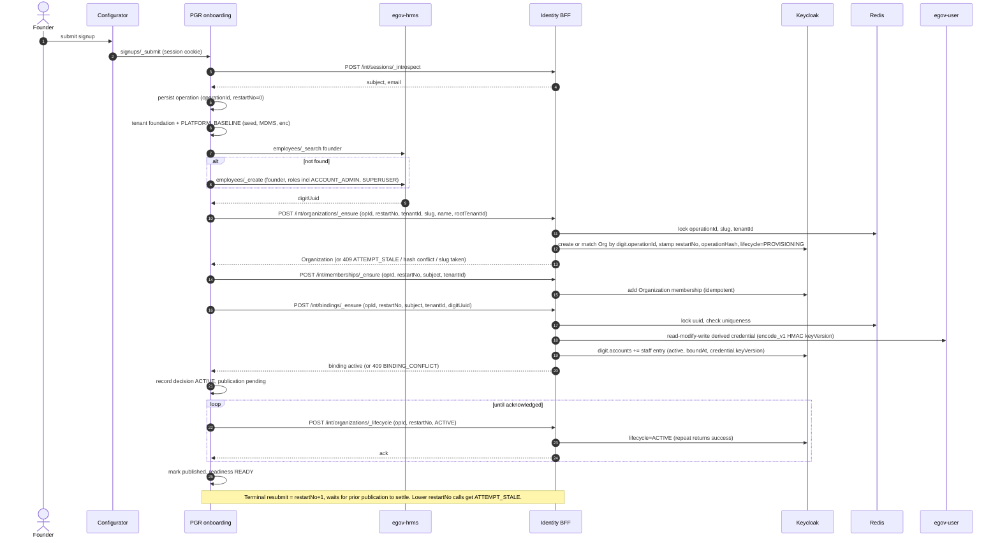
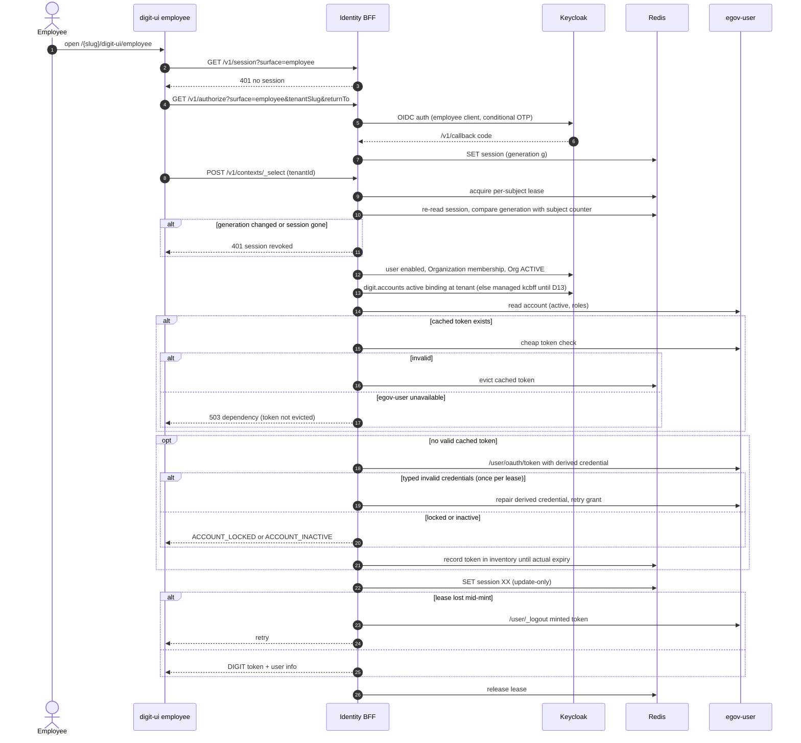
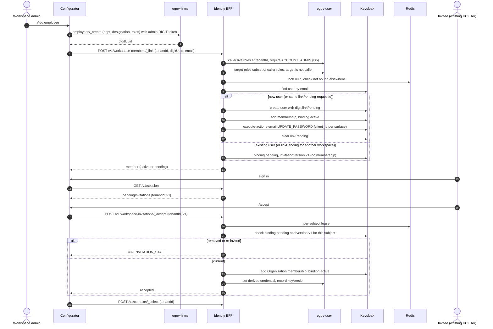
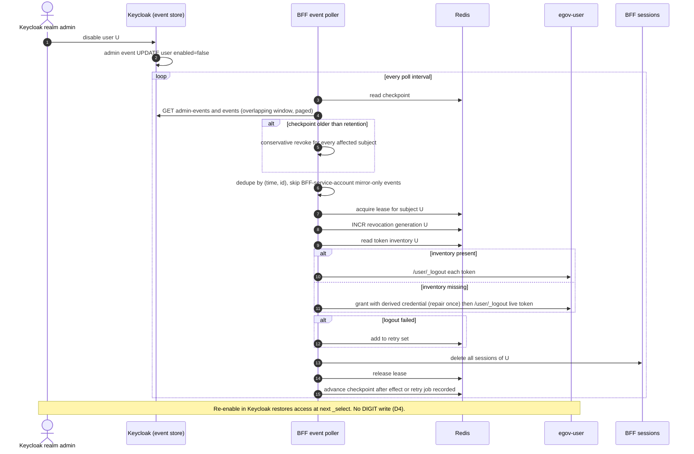
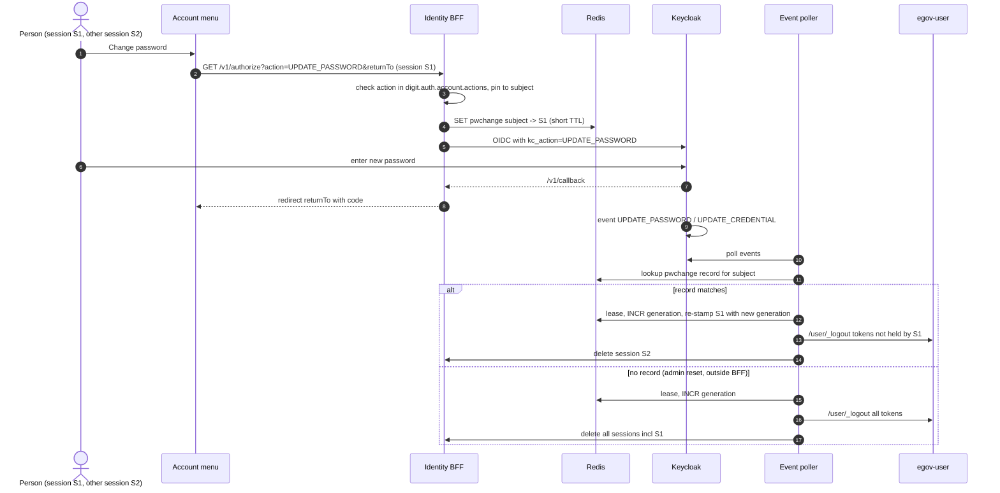
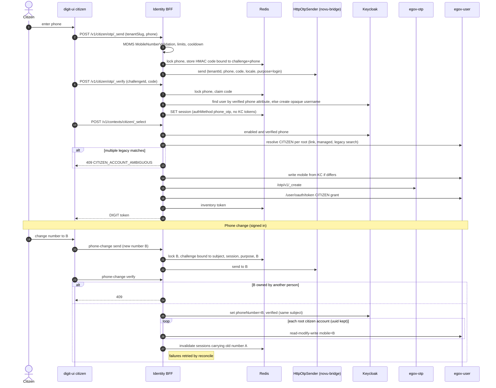
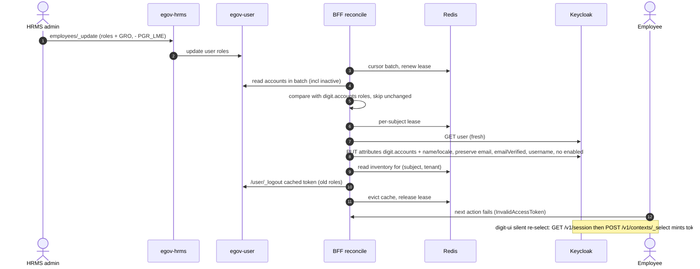

# 04 — Use cases and flows (walkthrough reference)

**Target:** `IDENTITY-BFF-BOUNDARY-FREEZE.md` revision 6 (2026-10-03). Where this file and the freeze disagree, the freeze wins.
**"Today"** means the `wt-bff` tree (develop + #2190 #2201 #2206 #2192 #2205 #2199), as audited in
`_identity-bff-audit-2026-10-01/` (01, 02, 03, 05, 06, 07, 10). A route grep of `wt-bff/backend/identity-bff/src`
confirms that none of these exist yet: `workspace-members/*`, `workspace-invitations/_accept`, `organizations/_lifecycle`,
`memberships/_remove`, `bindings/_ensure`, `account/providers/_unlink`, the phone-change route and `restartNo`.

**Status vocabulary:**
- **works:** behaves as rev 6 wants today;
- **partly:** some of it exists, but rev 6 changes or completes it;
- **missing:** nothing exists;
- **changes:** something exists today but works differently, and rev 6 replaces it.

**Gate ids:** `G00`–`G35` number the §11 bullets in order. The full text of each is quoted in §4.2.

**Route shorthand:**
- `/v1/x` = `/identity/v1/x` (browser routes, session cookie per surface);
- `/int/x` = `/internal/identity/v1/x` (workload routes: introspection token for reads, control-plane token for writes);
- `PGR` = `pgr-services/v2/onboarding/*`.

---

## 1. Actors

| # | Actor | Surface(s) | DIGIT account kind | Identity predicate (§3) / authority |
|---|---|---|---|---|
| A1 | **Founder** | Configurator: sign-up (magic link, or Google/GitHub via `auth-methods?surface=configurator&intent=signup`), then `/configurator/manage`. Can also use the employee surface, since one binding serves both | **Linked staff** account. PGR creates it through HRMS `_create` and binds it via `/int/bindings/_ensure` (`active` at once). Founder roles include `SUPERUSER` (D11/O1) and `ACCOUNT_ADMIN` | Staff predicate: Keycloak user enabled, `active` binding at the tenant, Organization membership there. The Organization must be `ACTIVE` (absent lifecycle = `ACTIVE`). Admin routes also need live DIGIT `ACCOUNT_ADMIN` (D5) |
| A2 | **Workspace admin** (`ACCOUNT_ADMIN`) | Configurator (member screens, HRMS employee screens, account menu); employee surface | Linked staff (HRMS) | Staff predicate **plus live DIGIT `ACCOUNT_ADMIN` at that tenant** for `_link`, `_remove` and the member list. `TENANT_ADMIN` is retired. Browser binding rules apply: no self-bind, and no binding to an account that holds a role the caller lacks |
| A3 | **Employee** | digit-ui `/{slug}/digit-ui/employee`. Also the configurator if their DIGIT roles allow it | Linked staff (HRMS). The transition fallback is a managed `kcbff-` account until D13 | Staff predicate. DIGIT `active` (D4). Access is whatever the DIGIT roles grant |
| A4 | **Keycloak citizen** (Google or password) | digit-ui `/{slug}/digit-ui/citizen`, sign-in through a Keycloak redirect | One CITIZEN account per root tenant, found by verified phone. It has a `digit.accounts` entry and no binding. Legacy citizens are resolved by link → managed → legacy search | Citizen predicate: Keycloak user enabled **and holds a verified phone**. A Google user without a phone must do a phone step-up before `contexts/citizen/_select` |
| A5 | **Phone-only citizen** | digit-ui citizen surface, in-page OTP (`/v1/citizen/otp/_send` and `_verify`). The BFF issues the session, which holds **no Keycloak token** | CITIZEN per root (as A4). New Keycloak users get an opaque username; existing `phone-<sha256>` usernames stay | Citizen predicate (enabled + verified phone). No Keycloak credential, so no required actions: they edit their profile in DIGIT and change their phone through the BFF |
| A6 | **PGR onboarding worker** | Internal: `/int/sessions/_introspect` and `/int/identifiers/_check` (introspection token); `/int/organizations/_ensure`, `_lifecycle`, `/int/memberships/_ensure`, `_remove`, `/int/bindings/_ensure` (control-plane token) | Not an identity-bound account. It drives HRMS `_create` for the founder with its own DIGIT credential, which is a PGR concern | Trusted workload. Skips the actor rules (uuid uniqueness still applies). Fenced by the per-operation lock + `restartNo` (`ATTEMPT_STALE`) |
| A7 | **Keycloak realm admin** | Keycloak admin console | None | Acts **on** the predicate: disable or delete a user, logout-all, remove membership, admin password reset, IdP config, client attributes (`digit.auth.signin.methods`, `digit.auth.account.actions`). D6: blocking a citizen means disabling their Keycloak user. The BFF reacts through the event poller |
| A8 | **HRMS admin** | Configurator HRMS screens (`egov-hrms/employees/_create`, `_update`); digit-mcp `employee_create` for operators | Their own linked staff account, with HRMS roles | Authority over DIGIT roles and `active` (D1, D4). The BFF only mirrors DIGIT→Keycloak and revokes cached tokens on a role change |
| A9 | **Operator** | Shell / ansible / internal routes: `/int/reconciliation/_run`, the retained citizen `/int/account-links` routes, the one-time ops jobs (a)(b)(c), deploy config (HMAC key, `EGOV_OTP_HOST`, event store), `/readyz` | None | Holds the control-plane token. Runs the one-time jobs: (a) membership backfill, (b) `kcbff-` clean-out, (c) tenant routes |

---

## 2. Use-case inventory

Each UC lists its actor, trigger, preconditions (Pre), main flow, postconditions (Post), alternates and failures (Alt), gate, status and §10 item.

### 2.1 Sign-up and onboarding

**UC-01 — Founder creates an identity (sign-up)**
- **Actor:** A1. **Trigger:** "Sign up" on the configurator. **Pre:** the signup method is listed in `digit.auth.signup.methods`.
- **Flow:**
  1. `GET /v1/auth-methods?surface=configurator&intent=signup`.
  2. Magic link: `POST /v1/authentication/magic-link-requests {name,email}`. The BFF stores an HMAC-rate-limited draft, creates the Keycloak user draft, and calls phasetwo `/realms/{r}/magic-link`. Alternatively, `/v1/authorize?intent=signup&method=google`.
  3. Keycloak verifies the email by redemption, or runs the first-broker-login flow.
  4. `/v1/callback`: PKCE, nonce and azp checks; a configurator session is created; the draft profile is applied.
  5. `/v1/auth-results/:id` → configurator.
- **Post:** a Keycloak user and a configurator session. There is **no** DIGIT account and no Organization yet.
- **Alt:**
  - a repeat signup sends no mail when `unmanagedAttributePolicy` ≠ `ADMIN_EDIT` (#2121; installer fix IN-PR #2199);
  - provider errors are mapped by substring today; rev 6 item 6 replaces that with stable codes.
- **Gate:** G00 only (the contract test for the magic-link and callback routes). The founder persona in G01 starts at "sign-in", **not sign-up**.
- **Status:** works (BUILT).
- **§10:** 2 (`oauth`→`idp`, codes), 5 (password-setup `client_id` per surface), 6.

**UC-02 — Founder submits signup → workspace becomes ACTIVE (happy path)**
- **Actor:** A1 → A6. **Trigger:** PGR `signups/_submit`.
- **Pre:**
  - UC-01 is done;
  - the signup draft is valid;
  - the identifiers were checked (UC-06);
  - the baseline holds everything HRMS `_create` needs (department, designation, root boundary).
- **Flow (PGR owns the saga order, §5):**
  1. PGR `_introspect`s the founder session (UC-07). It persists the operation with `restartNo = 0`.
  2. PGR runs tenant foundation, then `PLATFORM_BASELINE` (seed, MDMS, enc key). There are no BFF calls here.
  3. PGR searches HRMS for the founder, and calls `egov-hrms/employees/_create` only if none exists, getting `digitUuid`.
  4. `POST /int/organizations/_ensure {operationId, restartNo, tenantId, slug, name, rootTenantId}`. Under the operation lock plus the slug and tenantId locks, the BFF stamps `digit.operationId`, `digit.restartNo`, `digit.operationHash` and lifecycle `PROVISIONING`.
  5. `POST /int/memberships/_ensure {operationId, restartNo, subject, tenantId}`: Organization membership only.
  6. `POST /int/bindings/_ensure {…, digitUuid}`: the binding is `active` at once, under the uuid lock. The DIGIT writer sets the derived credential and records `credential.keyVersion` in `digit.accounts` (§6 "at binding").
  7. PGR records its decision `ACTIVE` with the publication pending, then replays `POST /int/organizations/_lifecycle {state: ACTIVE}` until the BFF acks.
  8. Readiness is served from the PGR workspace row (#2103).
- **Post:** the Organization is `ACTIVE` and visible in routing, discovery and `_select`. The founder can `_select` (UC-09).
- **Alt:**
  - a retryable failure → UC-03;
  - terminal → UC-04 or UC-05;
  - a PGR crash anywhere → resumes on the same `restartNo`.
- **Gate:**
  - G24 "a PGR crash at every onboarding boundary";
  - G22 (publication crash points);
  - G01 (the founder persona, after this);
  - G04 "…during credential setup".
- **Status:** **changes**. Today the BFF worker runs all five steps (`onboarding/worker.ts:165-187`), creates a `kcbff-` account with no HRMS record, and grants roles through Keycloak groups. There are no `restartNo`, `_lifecycle` or `bindings/_ensure` routes.
- **§10:** 11, 7, 8, 14 (delete the worker, tenant-foundation and provisioner). §12: PGR saga port, founder via HRMS.

**UC-03 — Ordinary retry of an onboarding step (same restartNo)**
- **Actor:** A6. **Trigger:** a transient failure, or a lease expiry.
- **Flow:** PGR re-leases and replays the same primitive with the **same** `{operationId, restartNo}`. The BFF returns the existing Organization when the hash matches. `memberships/_ensure` is idempotent. `bindings/_ensure` returns the existing binding when the uuid is the same.
- **Alt:**
  - same restartNo with a different payload → 409;
  - the founder re-created with a different uuid → 409 `BINDING_CONFLICT` (PGR's HRMS search before `_create` should prevent this).
- **Gate:**
  - G18 "the same restartNo with a different payload";
  - G21 "a retried founder with a different uuid → `BINDING_CONFLICT`";
  - G24.
- **Status:** changes. Today the worker has no per-sub-step progress, and a mid-step crash burns the slug (audit 02 §5 #2).
- **§10:** 11.

**UC-04 — Terminal resubmission (restartNo+1): same founder, different founder, changed slug**
- **Actor:** A1 → A6. **Trigger:** the founder corrects the signup and resubmits (PGR `operations/_retry` or re-`_submit`; §11 calls this "PGR's real resubmit endpoint").
- **Pre:** the previous publication is **settled** (PGR waits). The Organization is `PROVISIONING` or `FAILED`.
- **Flow:**
  1. PGR increments `restartNo`.
  2. `organizations/_ensure` matches on `digit.operationId`, re-stamps every field and returns to `PROVISIONING`. If the slug changed, it creates a **new** Organization and sets the old one to `FAILED`.
  3. Different founder: `POST /int/memberships/_remove {…, subject: oldFounder}` removes the old membership and binding, then `memberships/_ensure` and `bindings/_ensure` run for the new founder.
  4. `_lifecycle ACTIVE`.
- **Alt:** a delayed call from the lower restartNo arrives → 409 `ATTEMPT_STALE`, even after the newer restart itself failed.
- **Gate:**
  - G20 "PGR's real resubmit endpoint re-opening a `FAILED` Organization after the founder was bound, with the same founder and with a different one (`memberships/_remove`), and with a changed slug";
  - G19 "repeated `ACTIVE`; delayed `_ensure`, `_lifecycle`, `memberships/_ensure` and `bindings/_ensure` from a lower restartNo → `ATTEMPT_STALE`, including after the newer restart itself failed".
- **Status:** missing.
- **§10:** 11.

**UC-05 — Terminal abandonment → FAILED**
- **Actor:** A6. **Trigger:** PGR classifies the failure as terminal.
- **Flow:** PGR records `FAILED` with the publication pending, then replays `/int/organizations/_lifecycle {state: FAILED}` until acked.
- **Post:** the Organization is hidden from routing, discovery and `_select`.
- **Alt:**
  - `FAILED` is **never** published for a retryable failure;
  - a crash before or after persisting the decision → the replay converges.
- **Gate:** G22 "a PGR crash just before and just after persisting its decision, before the lifecycle acknowledgement, and during a terminal resubmission → the Organization ends `ACTIVE` or `FAILED`, never stuck in `PROVISIONING`".
- **Status:** missing.
- **§10:** 11.

**UC-06 — Identifier availability and uniqueness races**
- **Actor:** A1 (through the configurator), A6.
- **Flow:**
  1. PGR `identifiers/_check` → `POST /int/identifiers/_check` (batched, **advisory**).
  2. The real uniqueness is enforced later by the slug and tenantId Redis locks inside `organizations/_ensure`. Another operation holding either one → 409.
- **Gate:** G18 "slug race; tenantId race; the same restartNo with a different payload".
- **Status:** partly. `_check` is BUILT. The locks are missing, and today `_ensure` always adopts (audit 02 §5 #4).
- **§10:** 11.

**UC-07 — PGR introspects the founder session**
- **Actor:** A6.
- **Flow:** PGR `IdentitySessionClient` → `POST /int/sessions/_introspect` with the introspection token. This is used only before `IDENTITY_READY`.
- **Gate:** G00 only.
- **Status:** works.
- **§10:** 0 (schema freeze).

**UC-08 — An existing Organization with no lifecycle attribute (transition)**
- **Actor:** A3, A1. **Trigger:** any sign-in on a tenant that pre-dates rev 6.
- **Flow:** the visibility rule treats an absent lifecycle as `ACTIVE`.
- **Gate:** G23 "an existing Organization without a lifecycle attribute stays visible".
- **Status:** missing (the rule is new). The behaviour is unchanged for existing tenants.
- **§10:** 11.

### 2.2 Sign-in and tenant selection

**UC-09 — Configurator staff sign-in and workspace selection**
- **Actor:** A1, A2.
- **Flow:**
  1. `GET /v1/auth-methods?surface=configurator`.
  2. `/v1/authorize?surface=configurator&returnTo`. Keycloak password or IdP; the realm SSO cookie is reused.
  3. `/v1/callback`, then `/v1/auth-results/:id`.
  4. `GET /v1/session` returns the identity, `pendingInvitations` (rev 6), `account.actions`, credential metadata and linked providers.
  5. `GET /v1/tenants` lists only `ACTIVE` Organizations where the staff predicate holds.
  6. `POST /v1/contexts/_select {tenantId}` (inside the lease, UC-10 steps 3–8).
- **Alt:**
  - no active binding → no tenant listed;
  - a pending invite only → listed under `pendingInvitations` (UC-18).
- **Gate:**
  - G01 (configurator founder, configurator admin);
  - G06 "Keycloak disable, logout-all and credential change during `_select` and during session refresh".
- **Status:** partly. It works today with managed accounts and the Keycloak group-role read. Linked accounts are **not** honoured on the configurator surface today (audit 05). There is no D10 predicate and no lease.
- **§10:** 8, 10, 6.

**UC-10 — Employee sign-in on the tenant route and `_select`**
- **Actor:** A3 (also A1 and A2 on the employee surface).
- **Pre:** the slug resolves. Today that is `GET /v1/tenant-contexts/:slug` on every boot; target: the digit-ui slug cache.
- **Flow:**
  1. digit-ui `useIdentityBffSignIn` → `GET /v1/session?surface=employee`. If there is no session: `/v1/authorize?surface=employee&tenantSlug&returnTo`. Keycloak runs the employee flow, with a conditional OTP when TOTP is enrolled (UC-16).
  2. Callback creates the session. `POST /v1/contexts/_select {tenantId}`.
  3. The BFF takes the **per-subject Redis lease** (the same one revocation takes).
  4. It re-reads the session record and compares the subject's **revocation generation** with the one stored on it. A mismatch → the session is dead.
  5. It checks the §3 staff predicate and the Organization `ACTIVE` state. The account is resolved as binding, else managed `kcbff-`, until D13.
  6. It mirrors `digit.accounts` and the profile from DIGIT (UC-27), and checks DIGIT `active` (D4).
  7. Cached token: a cheap egov-user check. Valid → return it. Invalid → evict and mint. A dependency error is **not** treated as invalid.
  8. Mint: derived credential, egov-user `/user/oauth/token` password grant. On the typed "invalid credentials" outcome, repair once (UC-52). Record the token in the inventory until its actual expiry. Save the session with `SET … XX`.
  9. If the lease is lost mid-mint, the minted token is revoked rather than returned.
- **Post:** a DIGIT token with the account's HRMS roles. digit-ui stores it in localStorage, and later loads make no BFF call.
- **Alt:**
  - `ACCOUNT_LOCKED` / `ACCOUNT_INACTIVE` (no repair);
  - `PENDING_INVITATION`;
  - an Organization that is not `ACTIVE` → hidden;
  - a crash between mint and record → covered by the Redis-loss fallback (UC-47).
- **Gate:**
  - G01;
  - G06;
  - G07 "a token revoked externally while still cached; a DIGIT role change revokes the cached token";
  - G10 "a crash between mint and record";
  - G12 "the derived credential passes egov-user validation; out-of-band password change → one repair; a locked account → no repair, `ACCOUNT_LOCKED`";
  - G29 "a cached token revoked outside the BFF → detected at `_select` and a new one minted; an egov-user outage is not treated as an invalid token".
- **Status:** **changes**. Today:
  - every `_select` without a cached token rotates the DIGIT password at random (`managed-account-service.ts:540-546`);
  - the egov-user error body is discarded (`digit-user-client.ts:74-89`);
  - session writes always overwrite (`session-store.ts:272-277`);
  - there is no lease and no generation.
- **§10:** 7, 8, 10, 6, 15 (perf).

**UC-11 — Keycloak citizen sign-in (Google or password) with phone step-up**
- **Actor:** A4.
- **Flow:**
  1. `GET /v1/auth-methods?surface=citizen` (a redirect method).
  2. `/v1/authorize?surface=citizen&method=google&tenantSlug`.
  3. `/v1/callback` creates the citizen session.
  4. No verified phone → digit-ui shows the phone screen: `POST /v1/citizen/otp/_send`, then `POST /v1/citizen/otp/_verify` in **step-up mode**. The challenge is bound to subject, session, purpose and number, under the per-phone lock. The BFF sets `phoneNumber` and `phoneNumberVerified` on **this** subject. If another person owns the phone → 409.
  5. `POST /v1/contexts/citizen/_select`. The BFF resolves the CITIZEN account per root (link → managed → legacy search by the verified phone), writes the verified phone KC→DIGIT, mints through egov-otp `/otp/v1/_create` plus the CITIZEN grant, and records it in the inventory.
- **Alt:**
  - phone owned by someone else → 409 (no merge in rev 6);
  - legacy ambiguity → UC-56.
- **Gate:** G01 (Keycloak citizen); G25 "two subjects claiming one phone…".
- **Status:** **missing**. Today `_select` 403s without a verified phone, there is no step-up, and the `digit-citizen` theme was cut (audit 06).
- **§10:** 13, 2. §12: the digit-ui post-Google phone screen and the theme revert.

**UC-12 — Phone-only citizen OTP sign-in**
- **Actor:** A5.
- **Flow:**
  1. `POST /v1/citizen/otp/_send {tenantSlug, phone}`. The number is checked against MDMS `MobileNumberValidation`, with limits and cooldown, an HMAC-stored code, and the per-phone lock. Delivery goes through `HttpOtpSender` (novu-bridge, #2203); `log` is the dev sender.
  2. `POST /v1/citizen/otp/_verify`: the challenge is bound to the challenge id and the phone. The BFF finds the Keycloak user by the current verified-phone attribute, or creates one with an **opaque** username.
  3. The BFF issues a session with no Keycloak tokens. Every 60 s it re-checks that the Keycloak user is enabled.
  4. `POST /v1/contexts/citizen/_select`: same as UC-11 step 5.
- **Alt:**
  - `OTP_CHANNEL_UNAVAILABLE`;
  - rate limited;
  - a citizen-method list that is empty today on `enable_otp_services` boxes (rev 6: return `[]`, not 503);
  - a Keycloak blip must not drop the session (item 15).
- **Gate:**
  - G01 (phone-only citizen);
  - G25;
  - G35: "at least one suite runs against real Keycloak, Redis, egov-user and egov-otp, including a **real non-fixed citizen OTP mint**".
- **Status:** partly. IN-PR #2201/#2205. The only sender is `LogOtpSender`. Usernames are `phone-<sha256>`. The egov-otp mint is unverified live.
- **§10:** 3, 13, 2, 15 (Keycloak blip, phone memo drift). O2.

**UC-13 — Signed-in page load, and BFF outage tolerance**
- **Actor:** A3, A4, A5.
- **Flow:** digit-ui boot parses `/{slug}/digit-ui/...` and resolves the slug from the **slug→context cache** in `tenantRoute.js`. The session comes from localStorage. There are **no** BFF calls (§1 "never called on a signed-in page load").
- **Gate:** G32 "BFF stopped → signed-in users keep working until expiry (needs the digit-ui slug cache)".
- **Status:** missing. Today every boot calls `GET /v1/tenant-contexts/:slug`, so with the BFF down the user sees "Tenant unavailable" (audit 03).
- **§10:** 15 (`Cache-Control` on tenant-contexts). §12: digit-ui slug cache.

**UC-14 — Expired DIGIT token → silent re-select**
- **Actor:** A3, A4, A5.
- **Flow:**
  1. The `Request.js` interceptor sees `InvalidAccessTokenException` and sends the user to `/{slug}/digit-ui/{surface}/…/login`.
  2. `useIdentityBffSignIn` calls `GET /v1/session`. A live session → silent `_select` (UC-10 steps 3–9). Otherwise `/v1/authorize`.
- **Gate:** **none** explicit. Audit 07 says "needs a test, not code" (#2198 checkbox).
- **Status:** works by construction.
- **§10:** none.

**UC-15 — Sign-in refused with a stable code**
- **Actor:** A1–A5.
- **Trigger:** no binding, a `pending` binding only, no membership, DIGIT inactive, locked, Keycloak disabled, an Organization not `ACTIVE`, or a citizen with no phone.
- **Flow:** `_select`, `callback` and `auth-results` return the stable codes `PENDING_INVITATION`, `ACCOUNT_LOCKED`, `ACCOUNT_INACTIVE`, `INVITATION_STALE` and so on. The frontends render them by code.
- **Gate:** G00 (the contract test asserts the codes); G12 (the `ACCOUNT_LOCKED` path).
- **Status:** partly. Results are English copy and substring matches today.
- **§10:** 6, 2.

**UC-16 — TOTP enforced at employee sign-in**
- **Actor:** A3.
- **Pre:** the person enrolled TOTP (UC-35).
- **Flow:** the employee Keycloak flow has a **conditional OTP step**, so a person with TOTP must use it.
- **Gate:** G26 "TOTP enrolment, **then enforcement at the next employee sign-in**…".
- **Status:** missing. Today `digit-employee-browser` is username and password only (`configure-keycloak.sh:209-213`), so enrolled TOTP is silently skipped on the employee surface.
- **§10:** none (Keycloak config, §12).

### 2.3 Staff membership and invitations

**UC-17 — Admin creates a new employee (HRMS `_create` + `_link`, new Keycloak user)**
- **Actor:** A2 (with HRMS rights, A8).
- **Flow:**
  1. The configurator calls `egov-hrms/employees/_create` (department, designation, jurisdiction, roles from MDMS) with the admin's DIGIT token, and gets back `digitUuid`.
  2. `POST /v1/workspace-members/_link {tenantId, digitUuid, email}`.
  3. The BFF checks:
     - the caller's **live DIGIT `ACCOUNT_ADMIN`** at `tenantId` (D5);
     - the actor rules (not self; the target's roles are a subset of the caller's);
     - uuid uniqueness under the uuid lock.
  4. Find the Keycloak user by email. If none, create it **with** `digit.linkPending = {tenantId, digitUuid, email, requestId}` in the same create call.
  5. Add Organization membership, create an `active` binding, and set the derived DIGIT credential (UC-60).
  6. Send the password-setup email (`execute-actions-email`, `client_id` per surface, item 5).
  7. Clear `linkPending`.
  8. The employee sets their password (a required action blocks any session until then), then signs in (UC-10).
- **Alt:**
  - the email belongs to an existing user → UC-18;
  - a crash between steps → repeating the same request resumes on the new-user branch;
  - a repeat never demotes `active` and never resurrects `removed`.
- **Gate:**
  - G02 "an admin creates an employee in the configurator, and that employee signs in";
  - G15 "`_link` crashing between user creation, membership, binding and email → a repeat resumes";
  - G13;
  - G04 ("…during credential setup").
- **Status:** **missing**. Today the configurator does HRMS `_create` with `eGov@123`, and the employee **cannot sign in** on tenant routes unless an operator calls the internal `/int/account-links/_link`. `_invite` has no caller and produces `kcbff-` accounts that PGR can't scope.
- **§10:** 9, 8, 7, 5. §12: configurator staff create = HRMS `_create` + `_link`.

**UC-18 — Admin links an existing Keycloak user, who accepts (pending → active)**
- **Actor:** A2, then A3.
- **Flow:**
  1. HRMS `_create` (as in UC-17).
  2. `POST /v1/workspace-members/_link`. The email matches an existing Keycloak user, or a user whose `linkPending` is for **another** workspace. The BFF creates a `pending` binding with an `invitationVersion` and the uuid reserved. **No membership yet.**
  3. The invitee signs in on the configurator. `GET /v1/session` returns `pendingInvitations` (no workspace selection needed).
  4. `POST /v1/workspace-invitations/_accept {tenantId, invitationVersion}`, bound to the authenticated subject. The BFF grants Organization membership, makes the binding `active`, and sets the credential.
  5. `_select` (UC-09 or UC-10).
- **Alt:**
  - a removed or replaced invitation → 409 `INVITATION_STALE`;
  - signing in on the employee surface before accepting → `PENDING_INVITATION`.
- **Gate:**
  - G03 "an existing user accepts an invite";
  - G16 "a person created by an unfinished link to workspace A is invited to workspace B → existing-user branch; remove, then re-invite → the old acceptance is rejected";
  - G14.
- **Status:** missing. Today `_invite` attaches existing users immediately, with no accept step (#2122).
- **§10:** 9, 8. §12: configurator accept screen.

**UC-19 — Re-invite and stale invitations**
- **Actor:** A2.
- **Flow:** an explicit re-invite issues a new `invitationVersion` and invalidates the old one. Accepting the old version → `INVITATION_STALE`.
- **Gate:** G14 "a stale or removed invitation; removing a `pending` binding releases the uuid"; G16.
- **Status:** missing.
- **§10:** 9.

**UC-20 — Admin lists workspace members**
- **Actor:** A2.
- **Flow:** `GET /v1/workspace-members?tenantId` (live `ACCOUNT_ADMIN`). It returns `active` and `pending` bindings.
- **Gate:** G00 only. G17 covers the D5 check, not the listing content.
- **Status:** missing. Today only `/int/account-links` (list), plus the Keycloak console.
- **§10:** 9.

**UC-21 — Admin removes a member (active or pending)**
- **Actor:** A2.
- **Flow:**
  1. `POST /v1/workspace-members/_remove {tenantId, subject|digitUuid}` (live `ACCOUNT_ADMIN`).
  2. The binding becomes `removed` (tombstone) and the uuid reservation is released.
  3. Organization membership is removed.
  4. Revocation for that subject and tenant: inventory logout, then the BFF sessions end.
- **Post:** the HRMS record is untouched; the BFF never writes DIGIT `active`.
- **Alt:** re-`_link` after removal goes through a fresh invite and never resurrects the binding.
- **Gate:**
  - G14;
  - G05 "Keycloak disable, delete or logout-all, and membership removal → revoked; re-enabling restores access with no DIGIT write";
  - G16.
- **Status:** missing. Today: `_unlink` (internal) or the Keycloak console.
- **§10:** 9, 10.

**UC-22 — Binding-rule enforcement**
- **Actor:** A2 (browser) vs A6 (workload).
- **Flow:** browser `_link` refuses:
  - binding the caller themselves;
  - binding a uuid whose DIGIT roles exceed the caller's;
  - a uuid that is already bound (checked under the uuid lock).

  The workload `bindings/_ensure` skips the actor rules, but uuid uniqueness still applies.
- **Gate:** G13 "binding rules: self-bind, escalation, a uuid racing two binds".
- **Status:** missing.
- **§10:** 8.

**UC-23 — D5 admin authority, checked live**
- **Actor:** A2.
- **Flow:** every admin route reads the caller's account (binding, else managed, until D13) and its **live** DIGIT roles at `tenantId`. `ACCOUNT_ADMIN` is required.
- **Alt:**
  - the role is removed in HRMS mid-session → the next admin call is denied;
  - an admin of tenant X acting on tenant Y → denied.
- **Gate:** G17 "D5: role removed mid-session; cross-tenant admin denied".
- **Status:** changes. Today `member-invitation-service.ts:39-51` reads Keycloak `TENANT_ADMIN` groups.
- **§10:** 9.

### 2.4 Roles and employment changes

**UC-24 — HRMS role change → mirror → cached-token revocation**
- **Actor:** A8.
- **Flow:**
  1. `egov-hrms/employees/_update` changes the roles.
  2. The next reconcile pass (or `_select`) reads DIGIT and writes the `digit.accounts` entry `roles` (Keycloak writer: fresh read, then PUT preserving the profile, under the per-subject lease).
  3. The roles differ from the previous mirror → revoke the cached token (egov-user logout).
  4. The next `_select` mints a token with the new roles.
- **Gate:** G07 ("…a DIGIT role change revokes the cached token"); G04 "concurrent HRMS edit during a mirror pass…".
- **Status:** **changes**. Today the reconcile **overwrites DIGIT roles from Keycloak** for managed accounts (`managed-account-service.ts:425-427`), and linked accounts are not reconciled.
- **§10:** 12, 10, 14 (delete the role projection and the allowlist).

**UC-25 — HRMS deactivation (DIGIT `active=false`)**
- **Actor:** A8.
- **Flow:** reconcile mirrors `active:false` into `digit.accounts`. At the next `_select`, D4 denies with `ACCOUNT_INACTIVE`.
- **Alt:** egov-user itself refuses the grant for an inactive account.
- **Gate:** partial. G09 mentions inactive staff only for the Redis-loss case. **No gate bullet asserts that a deactivation revokes an already-cached or already-issued token.**
- **Status:** partly (reconcile deactivates `kcbff-` rows today, but in the other direction).
- **§10:** 12, 10. See Q1.

**UC-26 — Descriptive profile mirror DIGIT→Keycloak (D3, D12)**
- **Actor:** system (reconcile, `_select`).
- **Flow:**
  1. Pick the D12 primary entry: the first binding by `boundAt`, or the next active one if the first is inactive or unbound.
  2. Read the DIGIT name and locale.
  3. Keycloak writer: re-read the user, PUT `attributes` + `firstName`/`lastName`/`locale`, **preserve** `email`, `emailVerified` and `username`, and never send `enabled`.
  4. Echo suppression ignores admin events by the BFF service account that touch only mirrored fields.
- **Gate:**
  - G08 "mirror writes preserve email, `emailVerified` and username (real Keycloak)";
  - G11 "…an admin disabling the user during a mirror pass (`enabled` never re-sent)";
  - G04.
- **Status:** missing. Today the name is copied once at create.
- **§10:** 12. §12: name fields read-only in the realm.

### 2.5 Profile and identifiers

**UC-27 — Staff or citizen edits their descriptive profile**
- **Actor:** A3, A4, A5.
- **Flow:** digit-ui profile → egov-user `/user/profile/_update` (name, photo, gender) with the DIGIT token. Identifier fields are **read-only**. Reconcile then mirrors the profile to Keycloak (UC-26).
- **Gate:** G01 (self-service, per persona); G08.
- **Status:** partly. Profile edit works, but mobile can be edited when `INDIVIDUAL_SERVICE_CONTEXT_PATH` is set, and nothing is mirrored.
- **§10:** 12. §12: digit-ui identifiers read-only; #2208 rescoped.

**UC-28 — Staff changes email (`UPDATE_EMAIL`), KC→DIGIT identifier propagation**
- **Actor:** A1–A4 (people with a Keycloak credential).
- **Flow:**
  1. Account menu → `/v1/authorize?action=UPDATE_EMAIL&returnTo` (allowlisted in `digit.auth.account.actions`, pinned to the initiating subject).
  2. Keycloak verifies the new email.
  3. The event poller sees the Keycloak-side change ("email verified"). The DIGIT writer does a read-modify-write of the email on each staff account (explicit field map; skipped if any field comes back masked). Reconcile retries.
- **Gate:** G34 "each §8 self-service action works on Keycloak 26.7.3". No bullet covers the propagation to DIGIT itself. G04 covers only the HRMS race.
- **Status:** missing.
- **§10:** 4, 12, 10 (poller).

**UC-29 — Citizen phone change**
- **Actor:** A4, A5.
- **Flow:**
  1. digit-ui "change phone number" → OTP to the **new** number. The challenge is bound to subject, session, purpose and new number, under the per-phone lock.
  2. Verify. If another person owns the number → 409.
  3. Update Keycloak `phoneNumber` and `phoneNumberVerified`.
  4. For each citizen account across the person's roots, write the mobile from the current Keycloak value. The uuid is kept.
  5. Sessions carrying the old number are invalidated. Reconcile retries any failed root.
- **Gate:** G25 "two subjects claiming one phone; a phone change across multiple roots; an old session racing the change; one person changes A→B, then another person verifies A".
- **Status:** missing. There is no route, and a new number means a new Keycloak user and an orphaned account today. Route name not frozen (audit proposed `POST /v1/citizen/phone/_change`), so **item 0 must freeze it**.
- **§10:** 13, 15 (the phone memo drift fix). §12: digit-ui change-phone flow.

### 2.6 Self-service credentials and providers (people with a Keycloak credential)

**UC-30 — Self password change (the initiating session survives)**
- **Actor:** A1–A4.
- **Flow:**
  1. Account menu → `/v1/authorize?action=UPDATE_PASSWORD&returnTo`.
  2. The BFF records `{subject, initiatingSession}` in Redis with a short TTL.
  3. Keycloak runs the required action.
  4. The poller sees `UPDATE_PASSWORD` / `UPDATE_CREDENTIAL` for the subject and finds the record. It increments the revocation generation and revokes every **other** session and token. The initiating session stays (it is re-stamped with the new generation).
  5. Back to `returnTo` with a code.
- **Alt:** cancelled → `returnTo` with a stable `code` (UC-37).
- **Gate:**
  - G27 "a self-service password change keeps the initiating session and signs out the others; an admin password reset signs out everything";
  - G06 (credential change during `_select` and refresh);
  - G34.
- **Status:** missing. Today digit-ui shows a DIGIT "Change password" (`/user/password/_update`) on the profile page. It is hidden on tenant routes, and §12 removes it.
- **§10:** 4, 10.

**UC-31 — TOTP enrolment (`CONFIGURE_TOTP`)**
- **Actor:** A1–A4.
- **Flow:** `/v1/authorize?action=CONFIGURE_TOTP`, then Keycloak enrolment. It is enforced at the next sign-in (UC-16).
- **Gate:** G26; G34.
- **Status:** missing.
- **§10:** 4.

**UC-32 — Remove a second factor (`delete_credential`)**
- **Actor:** A1–A4.
- **Flow:**
  1. `GET /v1/session` → credential metadata `[{id,type,label}]`.
  2. `/v1/authorize?action=delete_credential&credentialId=…`.
  3. This is offered only for TOTP and WebAuthn, so it can never remove a primary method.
- **Gate:** G26 ("removing a second-factor credential"); G34.
- **Status:** missing.
- **§10:** 4.

**UC-33 — Link a provider (`idp_link`)**
- **Actor:** A1–A4.
- **Flow:** `/v1/authorize?action=idp_link&alias=google`. Keycloak brokers the link. `GET /v1/session` then lists the provider.
- **Gate:** G34. G33 covers the "new identity provider" §9 row.
- **Status:** partly. Linking works at sign-in through first-broker-login. Post-hoc linking happens only in the hidden account console.
- **§10:** 4.

**UC-34 — Unlink a provider with last-method protection**
- **Actor:** A1–A4.
- **Flow:**
  1. `POST /v1/account/providers/_unlink {alias}`. This is session-authenticated and works on the person's own account only.
  2. Under the per-subject lease, the BFF freshly reads the person's primary methods (password, linked providers, and the phone for citizens; TOTP does not count).
  3. It refuses if this is the last primary method.
- **Gate:** G26 "…unlinking a provider; two concurrent provider unlinks against last-method protection".
- **Status:** missing.
- **§10:** 4.

**UC-35 — Forgot password / set a password on a federated-only account**
- **Actor:** A1–A3.
- **Flow:**
  1. `POST /v1/password/setup-requests` → Keycloak `execute-actions-email` (`UPDATE_PASSWORD`, plus `VERIFY_EMAIL` if the email is unverified).
  2. `GET /v1/password/setup-complete/:state`.
  3. The resulting credential-change event has **no matching initiating record**, so it revokes everything.
- **Gate:** none directly. G27 covers "admin password reset", which runs on the same "no matching record" branch, so this needs either a bullet or explicit confirmation that G27 covers it.
- **Status:** works (BUILT). The revocation on change is missing.
- **§10:** 5, 10.

**UC-36 — Phone-only citizen self-service**
- **Actor:** A5.
- **Flow:** profile edits go to DIGIT (UC-27) and phone changes to the BFF (UC-29). There are no required actions and the Keycloak account console is hidden.
- **Gate:** G01 (phone-only citizen self-service).
- **Status:** partly.
- **§10:** 13.

**UC-37 — Self-service action cancelled or failed**
- **Actor:** A1–A4.
- **Flow:** Keycloak returns to `/v1/callback` with an error, and the BFF redirects to `returnTo` with a stable `code`. Profile actions that would edit DIGIT-mirrored fields are excluded from the allowlist.
- **Gate:** G00 only.
- **Status:** missing.
- **§10:** 4, 6.

### 2.7 Revocation and sign-out

**UC-38 — Sign out of one surface**
- **Actor:** A1–A5.
- **Flow:** `POST /v1/logout?surface=`. The BFF deletes the session, releases this session's hold on the cached DIGIT token (and revokes it when no holder is left), and ends the Keycloak session.
- **Frontend changes:**
  - digit-ui **drops** the direct `/user/_logout` call;
  - the configurator header Logout **calls** `/v1/logout` (today it only clears local state).
- **Gate:** G01 ("…and logout").
- **Status:** partly. The BFF side works. The frontend sides are the §12 changes.
- **§10:** none (BFF). §12.

**UC-39 — Logout-all (Keycloak)**
- **Actor:** A7 (or the person, via Keycloak).
- **Flow:**
  1. The Keycloak `LOGOUT` / admin logout-all event lands.
  2. The poller pages and dedupes by `(time,id)`.
  3. Under the lease, the BFF increments the subject's revocation generation and revokes every inventoried token with egov-user `/user/_logout`. All BFF sessions end.
  4. The checkpoint advances only after the effect (or its retry job) is recorded.
- **Gate:**
  - G05;
  - G06;
  - G30 "real Keycloak representations of membership-removal and logout-all events; a retention-gap recovery covering every recoverable subject".
- **Status:** missing. Today a Keycloak-side revocation ends the BFF session at the next refresh (≤300 s), but **the cached DIGIT token is not revoked**.
- **§10:** 10.

**UC-40 — Keycloak disable or delete user → revocation; re-enable restores access**
- **Actor:** A7.
- **Flow:**
  1. Disable in Keycloak → an admin event → the poller revokes, as in UC-39.
  2. `_select` refuses, because the predicate fails.
  3. Re-enable → the next `_select` succeeds with **no DIGIT write** (D4: the BFF never flips DIGIT `active`).
  4. A deleted user → revoked. The binding is orphaned and cleaned by reconcile.
- **Gate:**
  - G05;
  - G06;
  - G11 ("an admin disabling the user during a mirror pass (`enabled` never re-sent)").
- **Status:** changes. Today reconcile deactivates `kcbff-` DIGIT rows when membership goes. Rev 6 never writes DIGIT `active`.
- **§10:** 10.

**UC-41 — Citizen blocked (D6)**
- **Actor:** A7.
- **Flow:** disable the Keycloak user, then the same path as UC-40. Phone-only sessions also see it on their 60 s re-check.
- **Gate:** G05 (generic). No citizen-specific bullet.
- **Status:** partly (sessions end on the re-check; tokens are not revoked).
- **§10:** 10.

**UC-42 — Membership removed in the Keycloak console (outside the BFF)**
- **Actor:** A7.
- **Flow:** the admin event for the membership removal → poller → revoke for that tenant. The D10 predicate then fails at `_select`.
- **Gate:** G05; G30.
- **Status:** missing.
- **§10:** 10.

**UC-43 — Admin password reset**
- **Actor:** A7.
- **Flow:** Keycloak console reset → credential-change event, with no matching initiating record → **revoke everything**.
- **Gate:** G27.
- **Status:** missing.
- **§10:** 10.

**UC-44 — Cached token revoked externally**
- **Actor:** system.
- **Flow:** `_select` checks the cached token against egov-user. If it is invalid, evict and mint. An egov-user outage is a dependency error, not "invalid".
- **Gate:** G29; G07.
- **Status:** missing.
- **§10:** 10.

**UC-45 — Revocation with the Redis inventory lost**
- **Actor:** system.
- **Flow:**
  1. There is no inventory for the subject.
  2. Sign in with the derived credential, which returns the account's **live** token. Repair once if needed. Log that token out.
  3. This works only for grant-eligible staff.
  4. Not recoverable (documented limit): citizens, inactive or locked staff, and a deleted mapping.
- **Gate:** G09 "revocation with Redis inventory lost: grant-eligible staff are revoked; inactive or locked staff, and a deleted mapping, follow the documented limit"; G10.
- **Status:** missing.
- **§10:** 10, 7.

**UC-46 — Failed revocation retry**
- **Actor:** system.
- **Flow:** a failed egov-user logout goes on the Redis retry set, kept until success or token expiry. The poller checkpoint can advance once the retry job is recorded.
- **Gate:** **none** explicit. It is implied by G11 and G30, but no bullet injects an egov-user logout failure.
- **Status:** missing.
- **§10:** 10.

### 2.8 Recovery and operations

**UC-47 — Event checkpoint outside retention**
- **Actor:** system / A9.
- **Flow:** the poller detects that its checkpoint is older than the Keycloak event retention. It revokes conservatively for every affected subject. `/readyz` reports the lag.
- **Gate:**
  - G11 "event checkpoint outside retention; duplicate and out-of-order events…";
  - G30 ("a retention-gap recovery covering every recoverable subject").
- **Status:** missing. The realm event store is also not configured (§12).
- **§10:** 10, 15.

**UC-48 — Reconcile pass**
- **Actor:** system / A9 (`POST /int/reconciliation/_run`, or the 300 s timer).
- **Flow:**
  1. Cursor batches with bounded concurrency, under a renewed lease.
  2. Read each account from DIGIT, inactive accounts explicitly.
  3. Skip unchanged entries.
  4. Mirror roles, active and profile (UC-24, UC-26). Revoke on a role change or a failed predicate. Retry identifier propagation.
  5. **Never** create or restore a membership or binding.
  6. Emit the lag metric.
- **Gate:** G04, G08, G11. **Capacity (batching, lag metric) has no gate bullet.**
- **Status:** changes. Today `syncSubject` does a full scan and projects KC→DIGIT.
- **§10:** 12, 10, 15 (perf).

**UC-49 — Out-of-band DIGIT password change → one repair**
- **Actor:** system.
- **Flow:**
  1. The mint returns the typed "invalid credentials" outcome.
  2. The DIGIT writer re-sets the derived credential (read-modify-write, field map, skipped if masked). Retry once per lease.
  3. A locked or inactive account → `ACCOUNT_LOCKED` / `ACCOUNT_INACTIVE`, no repair.
  4. A dependency error → no repair.
- **Gate:** G12.
- **Status:** missing.
- **§10:** 7.

**UC-50 — Credential key rollover**
- **Actor:** A9.
- **Flow:**
  1. Provision a new `key[keyVersion]` in the deploy config.
  2. At the next issuance per account, the BFF sets the new derived credential and records `credential.keyVersion`.
  3. Old versions are retained until no account uses them, because the Redis-loss fallback needs them.
- **Gate:** **none**.
- **Status:** missing.
- **§10:** 7.

**UC-51 — Derived credential first issuance for pre-existing links**
- **Actor:** system.
- **Flow:** the first `_select` after deployment, on a link created before rev 6, sets the derived credential and records the `keyVersion`. Per-login rotation is deleted.
- **Gate:** G12; G31 "existing admin-linked employees still sign in after the D10 backfill".
- **Status:** changes.
- **§10:** 7.

**UC-52 — Ops job (a): membership backfill before D10**
- **Actor:** A9.
- **Flow:** for every existing `active` binding on **every** box (8c, naipepea, bomet, moz), ensure Organization membership. Only then is D10 enforced.
- **Gate:** G31.
- **Status:** missing.
- **§10:** 8. §12 ops (a).

**UC-53 — Ops job (b): `kcbff-` listing and clean-out (D13), with binding-else-managed during the transition**
- **Actor:** A9.
- **Flow:**
  1. List the `kcbff-` managed employees per box and confirm they are unused.
  2. Clean them out.
  3. Item 14 removes the managed branch from D5 and `_select`.
- **Gate:** **none** explicit. No bullet asserts that `_select` still works for a managed-only user during the transition, or that it fails cleanly after the clean-out.
- **Status:** missing.
- **§10:** 14, 8. §12 ops (b).

**UC-54 — Ops job (c): tenant-route backfill**
- **Actor:** A9.
- **Flow:** the one-time backfill of root tenants into Organizations with a slug. Item 14 deletes the **permanent** `/int/tenant-routes/_backfill` route.
- **Gate:** **none** (G23 covers lifecycle visibility, not the routes).
- **Status:** partly (IN-PR #2206 route).
- **§10:** 14. §12 ops (c).

**UC-55 — Legacy citizen resolution and ambiguity**
- **Actor:** A4, A5, then A9.
- **Flow:**
  1. Citizen `_select` resolves: existing link → managed `kcbffc-` → legacy CITIZEN search by the verified phone.
  2. More than one match → 409 `CITIZEN_ACCOUNT_AMBIGUOUS` (fail closed).
  3. The operator resolves it with the **retained** internal citizen `/int/account-links/_link` (list, unlink).
- **Gate:** G28 "a legacy citizen with an ambiguous phone match → `CITIZEN_ACCOUNT_AMBIGUOUS`, then resolved by an admin through the citizen link route; unlink blocking".
- **Status:** works (`account-links.ts:190-237`).
- **§10:** 14 keeps these routes; 16.

**UC-56 — A realm admin extends the system by config only (§9)**
- **Actor:** A7, A9.
- **Flow:** each change is config only:
  - a new IdP (realm + client attribute);
  - a hosted authenticator;
  - a new surface (registry + client);
  - a new DIGIT role (MDMS, mirrored automatically);
  - a new OTP channel (sender endpoint);
  - a new self-service action (`digit.auth.account.actions` + theme);
  - a new login string.
- **Gate:** G33 "every §9 row exercised as a config-only change".
- **Status:** partly. A surface needs code today (closed union), and so do a new role (allowlist + realm script) and an OTP channel (log sender only).
- **§10:** 1, 2, 3, 4, 14.

**UC-57 — Health and readiness**
- **Actor:** A9.
- **Flow:** `/readyz` checks Redis, JWKS, the Keycloak admin token, each surface's catalogue, DIGIT reachability and poller lag. The `admin/admin` fallback is removed.
- **Gate:** **none**.
- **Status:** partly (`/readyz` probes MDMS at `pg` today).
- **§10:** 15.

**UC-58 — Legacy tenantless sign-in surfaces (transition, outside the BFF)**
- **Actor:** citizens and employees on `/digit-ui/...` with no slug, and digit-ui-v2 `/citizen/`.
- **Flow:** the legacy egov-user citizen OTP sign-in and registration path. This bypasses identity entirely. It stays live until #2072.
- **Gate:** **none** (out of BFF scope).
- **Status:** works today (and is a leak).
- **§10:** none. §12 digit-ui: delete the legacy login screens after #2072.

### 2.9 DIGIT3 migration (placeholder)

**UC-59 — One-time DIGIT3 authority switch**
- **Actor:** A9.
- **Pre:** the `digit.accounts` mirror is complete with no drift, and O3 (the DIGIT3 identity and role design) is settled.
- **Flow:**
  1. Stop the old writers, then drain.
  2. Compare the inventories.
  3. Reshape into the DIGIT3 grant model.
  4. Switch authority under a migration epoch.
  5. Invalidate sessions.
  6. Rollback is defined before cut-over.
- **Gate:** **none, by design** (a planned reopen, §7).
- **Status:** missing (blocked on O3).
- **§10:** none.

**Count: 59 use cases.**

---

## 3. Sequence diagrams

### 3.1 Founder signup → ACTIVE (restartNo, lifecycle publication)

### 3.2 Staff sign-in + `_select` (lease, session re-read, revocation generation)

### 3.3 Admin `_link` + existing-user `_accept`

### 3.4 Keycloak disable → event poller → revocation

### 3.5 Self password change (initiating session kept)

### 3.6 Citizen phone OTP sign-in + phone change

### 3.7 HRMS role change → mirror → cached-token revocation

---

## 4. Coverage check

### 4.1 UC → gate

| UC | Gates | | UC | Gates |
|---|---|---|---|---|
| 01 Founder sign-up | G00 only | | 31 TOTP enrol | G26 G34 |
| 02 Signup → ACTIVE | G01 G04 G22 G24 | | 32 Remove 2nd factor | G26 G34 |
| 03 Retry same restartNo | G18 G21 G24 | | 33 Link provider | G33 G34 |
| 04 Terminal resubmit | G19 G20 | | 34 Unlink provider | G26 |
| 05 FAILED | G22 | | 35 Forgot / set password | **none** (G27 by analogy) |
| 06 Identifier races | G18 | | 36 Phone-only self-service | G01 |
| 07 Introspect | G00 only | | 37 Action cancelled | G00 only |
| 08 No lifecycle attr | G23 | | 38 Single logout | G01 |
| 09 Configurator sign-in | G01 G06 | | 39 Logout-all | G05 G06 G30 |
| 10 Employee `_select` | G01 G06 G07 G10 G12 G29 | | 40 Disable/delete/re-enable | G05 G06 G11 |
| 11 KC citizen + step-up | G01 G25 | | 41 Citizen blocked (D6) | G05 |
| 12 Phone OTP sign-in | G01 G25 G35 | | 42 Membership removed in KC | G05 G30 |
| 13 Page load / BFF down | G32 | | 43 Admin password reset | G27 |
| 14 Expired token re-select | **none** | | 44 External token revoke | G07 G29 |
| 15 Refusal codes | G00 G12 | | 45 Redis inventory lost | G09 G10 |
| 16 TOTP enforced | G26 | | 46 Revocation retry set | **none** |
| 17 Admin creates employee | G02 G04 G13 G15 | | 47 Retention gap | G11 G30 |
| 18 Existing-user accept | G03 G14 G16 | | 48 Reconcile pass | G04 G08 G11 (capacity: none) |
| 19 Re-invite / stale | G14 G16 | | 49 Out-of-band pwd → repair | G12 |
| 20 Member list | G00 only | | 50 Key rollover | **none** |
| 21 Remove member | G05 G14 G16 | | 51 First issuance, old links | G12 G31 |
| 22 Binding rules | G13 | | 52 Ops (a) backfill | G31 |
| 23 D5 live check | G17 | | 53 Ops (b) `kcbff-` clean-out | **none** |
| 24 HRMS role change | G04 G07 | | 54 Ops (c) route backfill | **none** |
| 25 HRMS deactivation | G09 partial (no live-revoke bullet) | | 55 Legacy citizen ambiguity | G28 |
| 26 Profile mirror | G04 G08 G11 | | 56 Config-only §9 | G33 |
| 27 Profile edit | G01 G08 | | 57 `/readyz` | **none** |
| 28 `UPDATE_EMAIL` → DIGIT | G34 (propagation: none) | | 58 Legacy tenantless | **none** (out of scope) |
| 29 Phone change | G25 | | 59 DIGIT3 | **none** (by design) |
| 30 Self password change | G06 G27 G34 | | | |

### 4.2 Gate → UC (reverse index, with the quoted bullets)

| Gate | Bullet (quoted from §11) | UCs |
|---|---|---|
| G00 | "a test per frozen route asserting its schema and error codes" | all; it is the **only** cover for 01, 07, 15, 20 and 37 |
| G01 | "each persona (configurator founder, configurator admin, employee, Keycloak citizen, phone-only citizen) through sign-in, `_select`, self-service and logout" | 02 09 10 11 12 27 36 38 |
| G02 | "an admin creates an employee in the configurator, and that employee signs in" | 17 |
| G03 | "an existing user accepts an invite" | 18 |
| G04 | "concurrent HRMS edit during a mirror pass, and during credential setup" | 02 17 24 26 48 |
| G05 | "Keycloak disable, delete or logout-all, and membership removal → revoked; re-enabling restores access with no DIGIT write" | 21 39 40 41 42 |
| G06 | "Keycloak disable, logout-all and credential change during `_select` and during session refresh" | 09 10 30 39 40 |
| G07 | "a token revoked externally while still cached; a DIGIT role change revokes the cached token" | 10 24 44 |
| G08 | "mirror writes preserve email, `emailVerified` and username (real Keycloak)" | 26 27 48 |
| G09 | "revocation with Redis inventory lost: grant-eligible staff are revoked; inactive or locked staff, and a deleted mapping, follow the documented limit" | 25 45 |
| G10 | "a crash between mint and record" | 10 45 |
| G11 | "event checkpoint outside retention; duplicate and out-of-order events; an admin disabling the user during a mirror pass (`enabled` never re-sent)" | 26 40 47 48 |
| G12 | "the derived credential passes egov-user validation; out-of-band password change → one repair; a locked account → no repair, `ACCOUNT_LOCKED`" | 10 15 49 51 |
| G13 | "binding rules: self-bind, escalation, a uuid racing two binds" | 17 22 |
| G14 | "a stale or removed invitation; removing a `pending` binding releases the uuid" | 18 19 21 |
| G15 | "`_link` crashing between user creation, membership, binding and email → a repeat resumes" | 17 |
| G16 | "a person created by an unfinished link to workspace A is invited to workspace B → existing-user branch; remove, then re-invite → the old acceptance is rejected" | 18 19 21 |
| G17 | "D5: role removed mid-session; cross-tenant admin denied" | 23 |
| G18 | "slug race; tenantId race; the same restartNo with a different payload" | 03 06 |
| G19 | "repeated `ACTIVE`; delayed `_ensure`, `_lifecycle`, `memberships/_ensure` and `bindings/_ensure` from a lower restartNo → `ATTEMPT_STALE`, including after the newer restart itself failed" | 04 |
| G20 | "PGR's real resubmit endpoint re-opening a `FAILED` Organization after the founder was bound, with the same founder and with a different one (`memberships/_remove`), and with a changed slug" | 04 |
| G21 | "a retried founder with a different uuid → `BINDING_CONFLICT`" | 03 |
| G22 | "a PGR crash just before and just after persisting its decision, before the lifecycle acknowledgement, and during a terminal resubmission → the Organization ends `ACTIVE` or `FAILED`, never stuck in `PROVISIONING`" | 02 05 |
| G23 | "an existing Organization without a lifecycle attribute stays visible" | 08 |
| G24 | "a PGR crash at every onboarding boundary" | 02 03 |
| G25 | "two subjects claiming one phone; a phone change across multiple roots; an old session racing the change; one person changes A→B, then another person verifies A" | 11 12 29 |
| G26 | "TOTP enrolment, then enforcement at the next employee sign-in; removing a second-factor credential; unlinking a provider; two concurrent provider unlinks against last-method protection" | 16 31 32 34 |
| G27 | "a self-service password change keeps the initiating session and signs out the others; an admin password reset signs out everything" | 30 43 (35 by analogy) |
| G28 | "a legacy citizen with an ambiguous phone match → `CITIZEN_ACCOUNT_AMBIGUOUS`, then resolved by an admin through the citizen link route; unlink blocking" | 55 |
| G29 | "a cached token revoked outside the BFF → detected at `_select` and a new one minted; an egov-user outage is not treated as an invalid token" | 10 44 |
| G30 | "real Keycloak representations of membership-removal and logout-all events; a retention-gap recovery covering every recoverable subject" | 39 42 47 |
| G31 | "existing admin-linked employees still sign in after the D10 backfill" | 51 52 |
| G32 | "BFF stopped → signed-in users keep working until expiry (needs the digit-ui slug cache)" | 13 |
| G33 | "every §9 row exercised as a config-only change" | 33 56 |
| G34 | "each §8 self-service action works on Keycloak 26.7.3" | 28 30 31 32 33 |
| G35 | Real dependencies: "at least one suite runs against real Keycloak, Redis, egov-user and egov-otp, including a **real non-fixed citizen OTP mint**" | 12 |

### 4.3 Gaps

**UCs with no gate test** (excluding G00, which only asserts schema and codes):
- **UC-14:** expired DIGIT token → silent re-select (#2198 checkbox; audit 07 asks for a test).
- **UC-35:** forgot or set password via `password/setup-requests`, and its revoke-everything effect. It is G27-adjacent but not named.
- **UC-46:** revocation retry set (an egov-user logout failure is never injected).
- **UC-50:** HMAC key rollover and key-version retention.
- **UC-53:** `kcbff-` transition (binding-else-managed) and the D13 clean-out.
- **UC-54:** tenant-route backfill.
- **UC-57:** `/readyz` (including poller lag).
- **UC-58:** legacy tenantless and digit-ui-v2 sign-in (out of BFF scope, but it bypasses the identity predicate entirely).
- **UC-59:** DIGIT3 (by design).

**Partly covered:**
- **UC-25:** DIGIT deactivation revoking live tokens.
- **UC-28:** `UPDATE_EMAIL` propagation KC→DIGIT.
- **UC-48:** reconcile capacity and lag.
- **UC-01:** founder **sign-up**; G01 starts at sign-in.
- **G00-only:** UC-07 introspection, UC-20 member list content, UC-37 action cancellation.
- **UC-41:** a phone-only citizen blocked by disable; there is no citizen-specific revocation bullet, and their tokens are uninventoried after Redis loss.

**Gate tests with no UC:** none. Every G00–G35 maps to at least one UC. G33 and G35 each map to exactly one (UC-56, UC-12).

---

## 5. Questions for the owner

1. **DIGIT deactivation → revocation.**
   - §4 mirrors employment status, but §6 and item 10 name only "enabled/membership/role" revocation.
   - Does reconcile revoke the cached and live tokens when HRMS sets `active=false`, or does the deactivated employee keep working until the token expires?
   - No gate bullet asserts it (UC-25).
2. **Pending invitations on the employee surface.**
   - §12 puts the accept screen only in the configurator.
   - An employee-only invitee who opens `/{slug}/digit-ui/employee` gets `PENDING_INVITATION`. Do they have to go to the configurator to accept, or does digit-ui get an accept step too?
3. **Sub-tenants.**
   - D15 deletes `tenant-groups/_ensure`, but the binding key is the DIGIT account tenant.
   - How is "Organization membership **there**" (D10) evaluated for a sub-tenant employee? Is root membership enough?
   - Does `_link` accept a sub-tenant `tenantId`?
4. **Citizen and staff on one Keycloak subject.**
   - If `_link` targets an email that already belongs to a Keycloak citizen (Google), that person ends up with a CITIZEN entry and a staff binding.
   - Is that allowed?
   - D12 profile ordering: which entry wins, and should citizen entries be excluded from it?
5. **Matching a self password change.**
   - How is the credential-change event matched to the recorded initiating session: subject plus TTL window only?
   - Two tabs both start `UPDATE_PASSWORD`, or an admin reset lands inside the TTL: does the admin reset wrongly keep a session?
6. **Phone-change route name and step-up semantics.** These are not frozen in rev 6. Item 0 should name the routes:
   - `citizen/phone/_change`?
   - is step-up a mode of `otp/_verify`?
7. **Expired-token re-select and `refresh_token`.** Should UC-14 get a gate bullet? Does `_select` return `refresh_token`? The embedded dashboard's refresh (audit 07 #21) depends on it, and so does G32.
8. **The `kcbff-` transition.** How is "confirmed unused" (D13) defined? Should G31 be extended to "managed-only user still signs in before item 14 and gets a clean code after"?
9. **Escalation via HRMS.** `_link` blocks binding to a higher-role account, but the same `ACCOUNT_ADMIN` can create that account through HRMS first. Do HRMS role-actions already prevent an admin from granting roles they lack, or is the `_link` check only half a control?
10. **Legacy tenantless and digit-ui-v2 sign-in** (legacy egov-user citizen OTP path). Is it acceptable that G01–G35 pass while this path is live on bomet, or is #2072 a precondition for declaring §0 complete?
11. **Founder credential timing.** Is the derived credential set inside `bindings/_ensure` (a workload call doing a DIGIT write), or lazily at the founder's first `_select`? It matters for G24 crash points and for the HRMS-generated password window.
12. **Key rollover and `/readyz`** have no gate. Add them, or accept them as untested?
13. **Phone-only citizen revocation.** There is no Keycloak session and no derived credential. After Redis loss a disabled citizen's tokens live until expiry (a documented limit). Is the citizen token TTL short enough to accept that?
